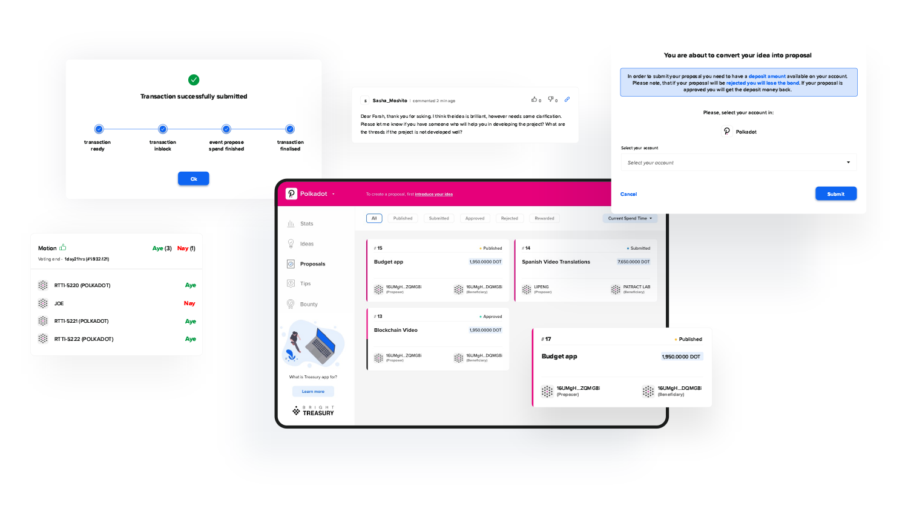
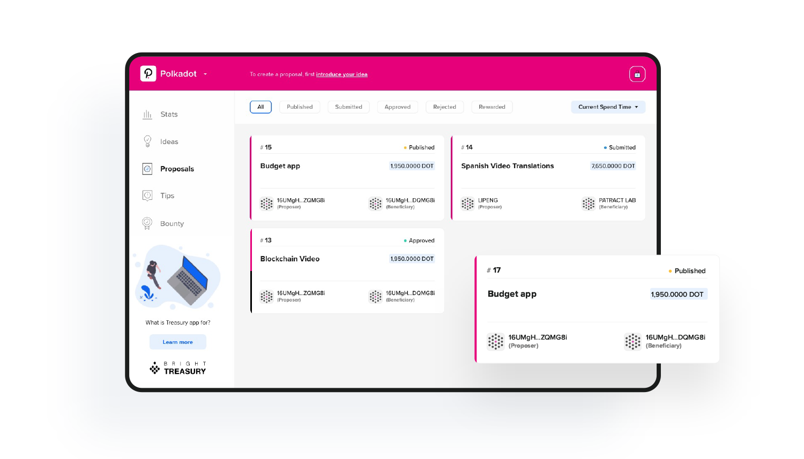
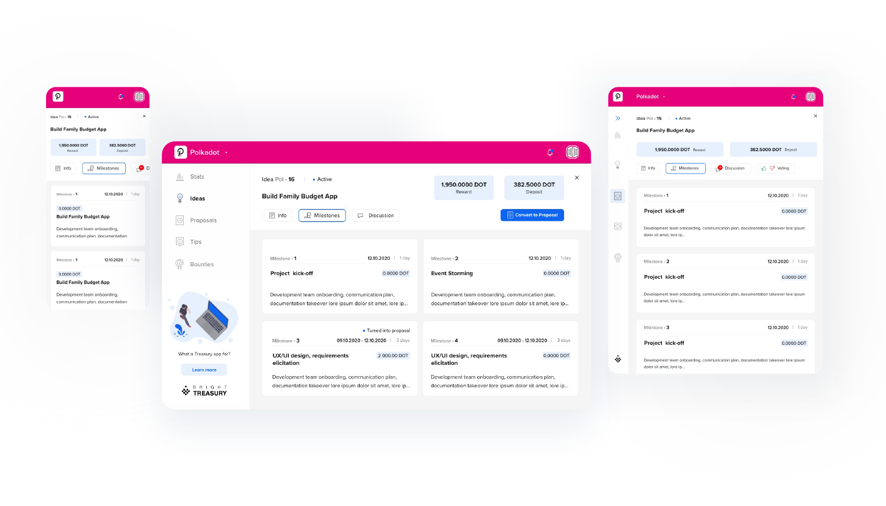

---
team_members:
  - kasia
  - joanna-c
  - michal
  - agnieszka
our_service:
  - MVP development
  - web development
  - product design
layout: project
project_id: bright-treasury
title: Managing Substrate Treasury Proposals – Web3Foundation App Development
image: /images/case_study_bright_treasury_update.png
description: "Bright Inventions’s original solution. A web app supporting
  Substrate Blockchain networks: Polkadot and Kusama in uploading proposals for
  Treasury grants."
hero_image: /images/case_study_web_app_brighttreasury.png
Hero Image_alt: BrightTreasury
social_media_previev: /images/fb_preview_case_study_brighttreasury.png
social_media_previev_alt: BrightTreasury case study
bar_achievements:
  - number: "4"
    label: Bright people on the project
  - number: "2"
    label: "Communities: Polkadot & Kusama"
  - number: "1"
    label: web app
tags:
  - web app
  - product design
  - MVP
  - blockchain
  - fintech
  - customized software
title_team: team behind the project
title_case_study: more case studies
title_contact: let's talk about your product
description_contact: Tell us more about your mobile project or idea for an app.
  Fill out the form below and we'll get back to you in 48 hours.
order: 99
slug: bright-treasury
show_team: true
show_case_study: true
show on homepage: true
published: true
work_in_progress: false
language: en
---

<TitleWithIcon sectionTitle="main features of BrightTreasury:" titleIcon="/images/main_features_icon.png" titleIconAlt="Main features of BrightTreasury:" />

<SliderText sliderElements='[{"title":"intuitive treasury submissions","description":"An intuitive, two-step flow for submitting proposals (Idea -> Proposal)."},{"description":"In-app module for more detailed proposal descriptions (like adding milestones) connected with the proposal related discussion and reporting progress on approved proposals.","title":"In-app module"},{"title":"proposals overview","description":"Clear overview of the submitted proposals matched with derived motions and their results"},{"description":"Historical overview of the past spending periods’ proposals that were submitted using the app.","title":"historical overview "},{"title":"bounties mechanism","description":"The first app with dedicated bounties implementation."},{"title":"in-app login","description":"Login with Web3 account or email."}]' />

<TitleWithIcon sectionTitle="stack" titleIcon="/images/skills.svg" titleIconAlt="bright" />

<Gallery images='[{"src":"/images/react_stack_logo_update.svg","alt":"React"},{"src":"/images/typescript_logo.png","alt":"TypeScript"},{"src":"/images/node_stack_logo_update.svg","alt":"Node"},{"src":"/images/nest.png"},{"src":"/images/postgresql_logo_stack.png","alt":"PostgreSQL"}]' />

**technologies:** React, TypeScript, Node.js, NestJS, TypeScript, PostgreSQL, AWS

<TitleWithIcon sectionTitle="about BrightTreasury" titleIcon="/images/three_flags.svg" titleIconAlt="about BrightTreasury" />

<YouTubeEmbed url='https://www.youtube.com/watch?v=AKe5HynDQnU' />

The [Treasury](https://wiki.polkadot.network/docs/learn-treasury) is a cryptocurrency pot of funds collected mostly through transaction fees, slashing and staking inefficiency. The fund is managed by Polkadot and Kusama Substrate networks. The Treasury funds can be spent on any proposal related to developing or promoting the [Substrate Blockchain](/blog/5-benefits-of-substrate-blockchain) technology. Bright Inventions has been developing a web application that will make the grunt application more user-friendly. The project was backed by Substrate community by receiving a grant from the [Web3 Foundation](https://web3.foundation/). The first stage of development was funded by Web3 Foundation. Now the app is 100% supported by Polkadot and Kusama Treasuries.

<blockquote class="twitter-tweet">
PSA to the DotSama community 💻🤩🎉<a href="https://twitter.com/BrightDevs?ref_src=twsrc%5Etfw">@BrightDevs</a> developed something awesome to ease the treasury proposal submission process on <a href="https://twitter.com/kusamanetwork?ref_src=twsrc%5Etfw">@kusamanetwork</a> and <a href="https://twitter.com/Polkadot?ref_src=twsrc%5Etfw">@Polkadot</a>:   BrightTreasury: <a href="https://t.co/NQy8r7vIbi">https://t.co/NQy8r7vIbi</a>   (1/6) <a href="https://t.co/HRi3ESluxW">pic.twitter.com/HRi3ESluxW</a>
&mdash; R.I.Rtti (@nachortti) <a href="https://twitter.com/nachortti/status/1471109810322030596?ref_src=twsrc%5Etfw">December 15, 2021</a></blockquote> 

<AnchorLink href='#contactForm' text='let’s talk about your project'/>

<TitleWithIcon sectionTitle="goal" titleIcon="/images/icon_title_goal.svg" titleIconAlt="goal" />

Our focus is to attract more professionals who could contribute to the community with their ideas and skills but at the same time may not be as fluent in blockchain customs and terminology. BrightTreasury application help them apply their proposals even if they aren’t blockchain experts. The funds are available for software agencies as well as companies that want to share knowledge about Substrate such as marketing agencies or video production studios. We believe that BrightTreasury app offers a chance to increase the number of fund proposals. Eventually, it will make the Substrate Blockchain a more accessible technology.

<AnchorLink href='#contactForm' text='let’s talk about your project'/>

<TitleWithIcon sectionTitle="process of developing BrightTreasury" titleIcon="/images/gearwheel.svg" titleIconAlt="process of developing BrightTreasury" />

Based on the discussions with the Substrate networks’ users and council members as well as the analysis of the comments under Polkadot and Kusama proposal submissions, we identified the areas that caused most issues in the Treasury funding process from the user’s perspective. The main needs that were brought up were:

* a more intuitive proposal submission flow, with the clearer indication of a proposal idea being subject to the community discussion, before submitting to blockchain and committing with bond funds 
* one place for following the submitted proposals, their status and the results of motions
* a unified discussion forum to leave comments about the submitted proposals as well as their draft versions (ideas)
* the implementation of the new bounties funding mechanism

Following these needs, we have proposed a solution that will benefit the Substrate chains communities.

The [custom software development](/our-areas/custom-software-development) process was broken into three milestones. The first two were completed in July 2021. The third one was completed in 2022. 

### Milestone 1 — Idea creating & Proposal submission & in-app logins

The main goal of this milestone is to implement the core flow of the app, which is the Proposal lifecycle. As a result, the user will be able to create an Idea, add all the necessary details, create Milestones for an Idea, make it public and decide to submit the Idea to the blockchain, turning it into a formal Proposal. The status of the Proposal will be then updated based on the data returning from the API. To perform these actions a user will need to be logged in, however, browsing through ideas and proposals will be available to everyone. 

### Milestone 2 — discussions panel & treasury overview & multiple networks

The goal of this milestone is to add more features to the ideas and proposals handling. The ideas as well as proposals will have the discussion functionality added and it will be possible to add them to multiple networks as well, as the representation of multiple blockchain networks feature will also be implemented at this stage. What is more, an overview of the treasury statistics will be presented for each network respectively. 

### Milestone 3 — Bounties & in-app history

The main goal of this milestone is the implementation of the bounties mechanism. Users will be able to add and browse through bounties, vote for their curators and check the current status. The curators will be able to accept (or reject) their nominations and manage the bounty’s status. Additionally, in this milestone we plan to add a basic integration with Polkassembly. It will be possible to see the description of a proposal/bounty published on Polkassembly. We will also include the history feature based on the data from Polkassembly, which would allow users to browse through the closed proposals and bounties in addition to in-app ideas.

<TitleWithIcon sectionTitle="result" titleIcon="/images/results_icon_title_small.png" titleIconAlt="result" />

BrightTreasury is live! 

The first version of the app was released in December 2021. After the launch the Substrate community appreciated the project and decided to support its further development and maintenance.