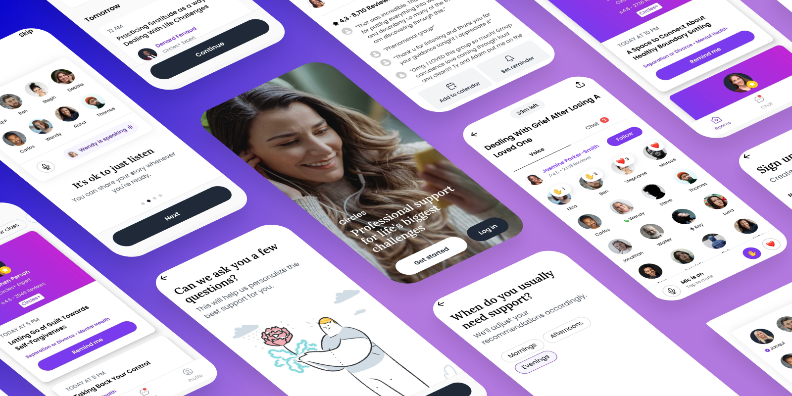
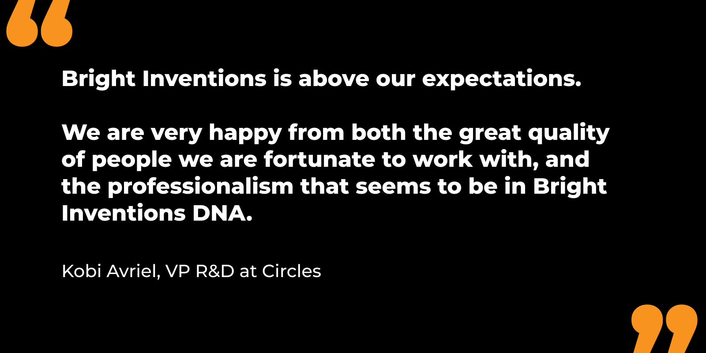
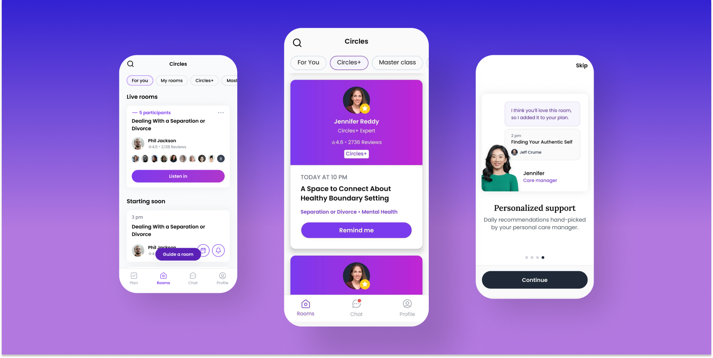

---
team_members:
  - dominik-d
  - slawek
  - rafal h
  - adam-k
our_service:
  - web development
  - mobile app development
  - cloud services
layout: project
project_id: circles
title: Circles secures $16.5M in Series A Funding and Emerges as Premier Group
  Support Platform
image: /images/case_study_cover_mental_health_app.png
description: Circles is an online group therapy application connecting
  individuals seeking emotional support. As a mental health tech startup, it
  pioneers the path for digitalized emotional assistance, offering guidance not
  only from professionals but also from people experiencing similar life
  challenges. We are thrilled to be on board with Circles, rocking the mission
  to make mental health care much more accessible in the USA.
hero_image: /images/case_study_online_therapy_woman.png
Hero Image_alt: Circles - mental health app
social_media_previev: /images/group_therapy_app_preview_some.png
social_media_previev_alt: Circles case study
bar_achievements:
  - number: $16.5 M
    label: Raised in Series A Round
  - number: 10k+
    label: Downloads on Google Play
  - number: "3"
    label: Years of Collaboration
tags:
  - web app
  - eHealth
  - customized software
  - mobile app
title_team: team behind the project
title_case_study: more success stories
title_contact: let's talk about your product
description_contact: Tell us more about your mobile project or idea for an app.
  Fill out the form below and we'll get back to you in 48 hours.
order: 1
slug: online-group-support
show_team: true
show_case_study: true
show on homepage: true
published: true
language: en
---

<TitleWithIcon sectionTitle="technologies" titleIcon="/images/skills.svg" titleIconAlt="technologies" />

<Gallery images='[{"src":"/images/new_typescript_logo_stack.png","alt":"TypeScript"},{"src":"/images/react.png","alt":"React"},{"src":"/images/node.png","alt":"Node.js"},{"src":"/images/postgresql_logo_stack.png","alt":"PostgreSQL"},{"src":"/images/aws.png","alt":"AWS"},{"src":"/images/docker_stack_logo.png","alt":"Docker"}]' />

**technologies**: TypeScript, React, Node.js (Express.js), PostgreSQL/Redis, AWS, React Native

<TitleWithIcon sectionTitle="problem: lack of access to mental health specialists in the USA" titleIcon="/images/icon_title_about.svg" titleIconAlt="problem" />

**More than 1 in 5 U.S. adults, roughly 57.8 million people — a number close to the population of Italy — live with a mental illness**. However, not everyone has the means to access mental health experts and receive the necessary assistance. 

This grim reality of mental health in the U.S. calls for a solution that not only provides Americans with professional mental health expertise but also offers something uniquely valuable in distressing moments: guidance and perspective from individuals who are grappling with similar issues.

<TitleWithIcon sectionTitle="the solution: online therapy platform for expert-guided group healing" titleIcon="/images/gearwheel.svg" titleIconAlt="the solution:" />

**[Circles](https://circlesup.com/), an Israeli startup, has launched a mental health tech application** designed for those dealing with grief, divorce, or simply seeking a safe space to express their emotions. 

<AppStore googleApp='https://circlesup-support.onelink.me/Zfmp/jvvug6g9' srcGoogle='/images/google_play.png' altGoogleImage='google play' appStore='https://circlesup-support.onelink.me/Zfmp/vn9898b2' srcAppStore='/images/app_store.png' altAppStoreImage='app store' />

After launching the pilot version, **Circles approached our team for expertise in scaling their product** in a competitive market. Initially involved in **web development**, we now offer support in other areas such as **mobile development** and **cloud computing**.

With Circles iOS or Android app, **users can easily join audio meetings led by mental health experts**. The audio drop-in and drop-out functionality, crafted by our team, not only offers easy access to mental support but also creates a sense of community. 

We also developed **numerous custom features to enhance the audio room experience, including user reactions, caller queuing, a call moderator panel, and an in-built chat**. Beyond group therapy sessions, Circles provides **continuous interaction with therapists** and a **personalized mental health plan** developed by its experts.

<TitleWithIcon sectionTitle="challenge: adapting to the rapid growth of the user base" titleIcon="/images/gearwheel.svg" titleIconAlt="challenge" />

**Circles is experiencing a phase of steady growth, continually attracting an increasing number of users**, particularly in the mobile sector. **As the app's user base expands, it brings forth scalability challenges** that every DevOps team must confront. Our primary focus is not just on adapting to these changes but on proactively preparing the infrastructure beforehand.

**Our current cloud computing priority is horizontal scaling** which is a technique used to increase the capacity and performance of a system by adding more instances of the same component. By horizontally scaling, **Circles will achieve higher availability, better load balancing, and the capability to handle larger user loads seamlessly, ensuring the best possible app experience for users**.

<TitleWithIcon sectionTitle="Circles’ perspective" titleIcon="/images/clients_perspective_icon.svg" titleIconAlt="Circles’ perspective" />

**Kobi Avriel – VP R&D at Circles**

*We have found Bright Inventions to be a professional group of people that we feel we can trust, as an integral part of our company, not only to deliver in the right quality, but be proactive, contributing from their experience to help us shape the company’s R&D and product. Their ability to source experts has been exceptional.*   

*Bright Inventions is above our expectations, and we are very happy from both the great quality of people we are fortunate to work with, and the professionalism that seems to be in Bright Inventions DNA.*

<TitleWithIcon sectionTitle="the results of the collaboration" titleIcon="/images/icon_result_svg.svg" titleIconAlt="the results of the collaboration" />

Notable milestones mark the journey of Circles. **In their Series A funding round, the Israeli startup successfully raised $16.5 million**. Not only do they get a thumbs-up from investors, but their solution is also making waves in the mental health community.

**Circles was honored with the title of 'Best for Group Support' emerging as a winner in the Online Therapy & Wellness Awards, organized by [Verywell Mind](https://www.verywellmind.com/verywell-mind-s-2023-online-therapy-and-wellness-awards-7966994)**. We are delighted to assist Circles on their impressive way to digitalize mental health.