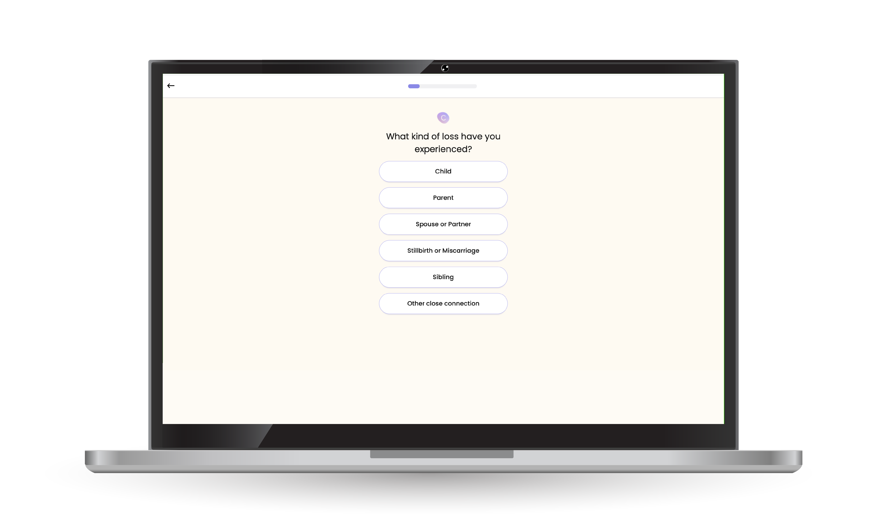

---
team_members:
  - dominik-d
  - slawek
  - rafal h
  - adam-k
our_service:
  - web development
  - mobile app development
  - cloud services
layout: project
project_id: circles
title: Secures $16.5M in Series A Funding. Circles Emerges as Premier Group
  Support Platform
image: /images/circles_case_study_cover.png
description: Circles is an online group therapy application connecting
  individuals seeking emotional support. As a mental health tech startup, it
  pioneers the path for digitalized emotional assistance, offering guidance not
  only from professionals but also from people experiencing similar life
  challenges. We are thrilled to be on board with Circles, rocking the mission
  to make mental health care much more accessible in the USA.
hero_image: /images/case_study_circles_ehealth.png
Hero Image_alt: Circles - mental health app
social_media_previev: /images/circles_fb_preview.png
social_media_previev_alt: Circles case study
bar_achievements:
  - number: 10k+
    label: Downloads on Google Play
  - number: "6"
    label: Bright team members
  - number: 2+
    label: Years of collaboration
tags:
  - web app
  - eHealth
  - customized software
  - mobile app
title_team: team behind the project
title_case_study: more success stories
title_contact: let's talk about your product
description_contact: Tell us more about your mobile project or idea for an app.
  Fill out the form below and we'll get back to you in 48 hours.
order: 99
slug: online-group-support
show_team: true
show_case_study: true
show on homepage: true
published: true
language: en
---
<TitleWithIcon sectionTitle='main features developed by Bright Inventions:' titleIcon='/images/icons_features_svg.svg' titleIconAlt='main features' />

<SliderText sliderElements='[{"title":"Audio rooms","description":"Live audio rooms with up to 50 participants on iOS and Android apps."},{"title":"Various audio room functions","description":"The audio room includes various functions such as reactions, caller queuing, a moderator panel for calls, and an integrated chat feature."},{"title":"App payments","description":"Mobile app payments with different pricing tiers and plans."},{"title":"Web and mobile onboarding","description":"Onboarding which helps users quickly find the support group suitable for their needs."},{"description":"Features for video conferences such as group chat or screen sharing by a group facilitator.","title":"Video conferences"},{"title":"Direct messaging","description":"Direct messaging for group members."},{"title":"Panel for therapists","description":"Admin panel dedicated to therapists conducting group meetings."},{"description":"Redesign of the group space where group members can interact with each other.","title":"Group space redesign "},{"title":"Business and analytics tools","description":"Customized business tool for processing user experience, traffic and acquisition data."}]' />

<TitleWithIcon sectionTitle='skills' titleIcon='/images/skills.svg' titleIconAlt='skills' />

<Gallery images='[{"src":"/images/new_typescript_logo_stack.png","alt":"TypeScript"},{"src":"/images/react.png","alt":"React"},{"src":"/images/node.png","alt":"Node.js"},{"src":"/images/postgresql_logo_stack.png","alt":"PostgreSQL"},{"src":"/images/aws.png","alt":"AWS"},{"src":"/images/docker_stack_logo.png","alt":"Docker"}]' />

**Frontend**: TypeScript, React

**Backend**: Node.js (Express.js), PostgreSQL/Redis, AWS

**Mobile**: React Native, mobx-state-tree

**DevOps/Deploy**: AWS, Docker, Jenkins

<TitleWithIcon sectionTitle='about Circles' titleIcon='/images/icon_title_about.svg' titleIconAlt='about' />

Be in grief over the loss of a special someone, the pain of divorce or separation, complex relationships or other challenges – [Circles](https://circlesup.com) offers theme-based online support circles facilitated by professionals.

<AppStore googleApp='https://circlesup-support.onelink.me/Zfmp/jvvug6g9' srcGoogle='/images/google_play.png' altGoogleImage='google play' appStore='https://circlesup-support.onelink.me/Zfmp/vn9898b2' srcAppStore='/images/app_store.png' altAppStoreImage='app store' />

Circles is a leading emotional support platform that connects people experiencing similar challenges in small online groups led by mental health experts. **Awarded as the Best Platform for Group Therapy 2021, Circles app has already supported thousands of people** while coping with grief, navigating divorce and separation, going through complex relationships or other life challenges.

Circles users attend live video and audio meetings. They also have the ability to message via online chat at any time and access personalized content, including self-help exercises, blogs, webinars.

<YouTubeEmbed url='https://youtu.be/gxwapWmv-zo' />

<TitleWithIcon sectionTitle='Circles development process' titleIcon='/images/gearwheel.svg' titleIconAlt='Circles Development Process' />

Circles is a product developed by a startup in Israel. The client came to us thanks to a referral from our long-term client. We started our collaboration in June 2021. The product was already launched. Our team of experienced bright Fullstack Developers joined to support product development. **We are responsible for the web and mobile versions of the app by delivering full-stack and cloud computing solutions**.

### Agile approach

Circles is a startup focused on building innovative mental health products. We provide support to our clients like Circles and proudly help them create products that have a significant impact on users. We are flexible and quickly adapt to the ever-changing nature of the startup environment. We understand that nothing remains constant in the pursuit of innovation. That's why we prioritize swift adjustments and offer tailored technical recommendations based on business needs.

Bright Inventions works closely with the client, joining daily and weekly meetings with various teams to understand the perspectives of every side including marketing and sales departments. Working with the Circles team means not only working on tech but also exploring the business nature of the project. 

### Web development

Since we came on board, we helped to develop a group chat adding new features such as user engagement via chat and other tools. What is more, we implemented a user-friendly Circles group discovery section which was a part of the web onboarding process. It helped users to find the right support group to join. Naturally, we are also responsible for app maintenance.

 *It is a mockup example created for the purpose of case study. It is based on the design made by Circles Product Design Team*. 

### Mobile development

After a successful collaboration in the web development area, **our client decided to engage our team in mobile development as well**. Since the beginning of 2022 mobile developers from Bright Inventions have **built cross-platform applications for Android and iOS with ReactNative**.

Mobile apps have become the core of Circles' solution. Thanks to the new audio meetings feature, delivered with the support of our mobile team, Circles attract new groups of users.

Audio drop-in and drop-out of conversations give users easy access to mental support and also offer them a sense of belonging. In order to develop a live audio meeting feature we implemented the Twilio library. 

Besides that, we still needed to develop custom solutions to adjust the audio room to specific clients' needs. As a result, we developed custom features such as reactions, callers queuing, call moderator panel and in-built chat. The implementation of the chat feature involved the usage of the GetStream library.

### Cloud computing

Circles is in the face of steady growth, acquiring more and more users, especially mobile ones. As the user base of the app expands, every DevOps team has to address scalability challenges. At Bright Inventions our primary focus is not just on adapting to these changes, but rather on proactively preparing the infrastructure beforehand.

That’s why our current cloud computing goal is horizontal scaling which is a technique used to increase the capacity and performance of a system by adding more instances of the same component. By horizontally scaling, Circles will achieve higher availability, better load balancing, and the capability to handle larger user loads seamlessly, ensuring the best possible app experience for users.

### Analytics

On top of that, we deliver solutions that enable analyzing data. For example, our team worked on a customized data tracking and processing solution that provides Circles specialists with automated reports widely covering users' activity, experience or traffic sources. All this information enables planning new features and making strategic business decisions for further growth.

<AnchorLink href='#contactForm' text='let’s talk about your project'/>

<TitleWithIcon sectionTitle='Circles’ perspective' titleIcon='/images/clients_perspective_icon.svg' titleIconAlt='Circles’ perspective' />

**Kobi Avriel – VP R&D at Circles**

*We have found Bright Inventions to be a professional group of people that we feel we can trust, as an integral part of our company, not only to deliver in the right quality, but be proactive, contributing from their experience to help us shape the company’s R&D and product. Their ability to source experts has been exceptional.*   

*Bright Inventions is above our expectations, and we are very happy from both the great quality of people we are fortunate to work with, and the professionalism that seems to be in Bright Inventions DNA.*

<TitleWithIcon sectionTitle='what is next' titleIcon='/images/icon_result_svg.svg' titleIconAlt='what is next' />

As always we will support our client and deliver the best possible solutions to satisfy the growing number of Circles users. Having in mind that we help to develop a unique product that enables people to go through life-changing events and offers them essential support. We are proud and grateful to be able to assist Circles in building such a unique healthcare application.

What is more, 2022 has become a very special year for our client! Circles raised $16.5 million in funding in their Series A round. Congratulations to the Circles team. 👏
