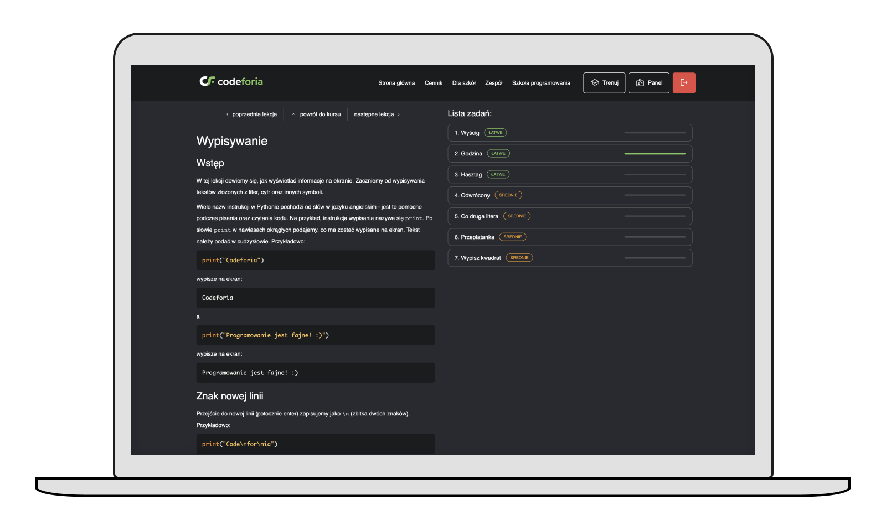
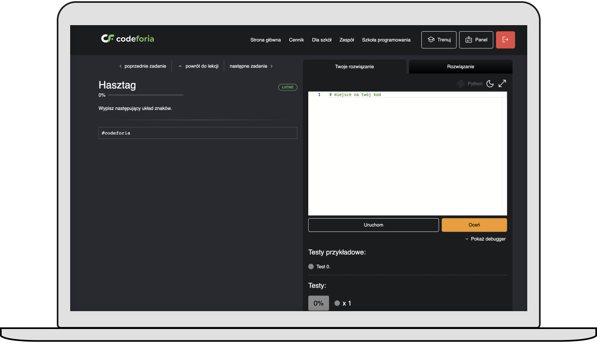

---
team_members:
  - krystian
our_service:
  - web development
  - custom software development
layout: project
project_id: codeforia
title: Codeforia – Learning Coding Platform
image: /images/codeforia_cover.png
description: Codeforia is a platform offering online programming courses for
  developers-to-be, schools, and educational organizations.
hero_image: /images/case_study_edu_tech.png
Hero Image_alt: Edutech
social_media_previev: /images/fb_preview_edutech.png
social_media_previev_alt: Edutech
bar_achievements:
  - number: "6"
    label: Months till the launch
  - number: "1"
    label: Bright developer on the project
  - number: "200"
    label: Coding tasks on the platform
tags:
  - web app
  - customized software
  - SME
title_team: team behind the project
title_case_study: more success stories
title_contact: let's talk about your product
description_contact: Tell us more about your mobile project or idea for an app.
  Fill out the form below and we'll get back to you in 48 hours.
order: 99
slug: e-learning-coding-platform
show_team: false
show_case_study: true
show on homepage: false
published: false
language: en
---
<TitleWithIcon sectionTitle="main features developed by Bright Inventions:" titleIcon="/images/icons_features_svg.svg" titleIconAlt="main features" />

<SliderText sliderElements='[{"title":"Panel displaying the offering","description":"Panel offering a variety of online programming courses with a buy option."},{"title":"Users panel","description":"Users panel with available courses and lessons progress."},{"title":"Customized and UX-friendly forms","description":"Logging and registration form."},{"title":"Lesson panel with coding tasks","description":"Code editor with black and dark mode options and change history. A debugger that shows the errors."},{"title":"Code running and testing options","description":"The code is tested with the pre-designed test cases."},{"title":"Gamification festures","description":"Animations showing the code solution, tasks progress bar and more."}]' />

<TitleWithIcon sectionTitle="skills" titleIcon="/images/skills.svg" titleIconAlt="skills" />

**Frontend development:** Next.js, React

<TitleWithIcon sectionTitle="about Codeforia" titleIcon="/images/icon_title_about.svg" titleIconAlt="about" />

[Codeforia](https://www.codeforia.com/) is a platform launched by a [programming school](https://www.jacektomasiewicz.pl/) established in 2015. Based on their experience in conducting effective programming courses, they decided to launch a customized web platform to offer a variety of paid online programming courses.

At Codeforia.com you will find over 200 programming challenges. The platform also enables you to automatically check your code and run it through test cases.

*It is a mockup example created for the purpose of the case study. It is based on the design made by Codeforia Team.*

<TitleWithIcon sectionTitle="goal" titleIcon="/images/icon_title_goal.svg" titleIconAlt="goal" />

Our client’s goal was to quickly build an e-learning platform that would enrich their educational offering and enable them to acquire clients within the education sector such as schools and universities. 

Codeforia helps students start their journey to become software developers. It allows course participants to deepen their theoretical knowledge. Each topic is enriched with lists of programming tasks that can be solved directly within the application. Solved tasks are automatically evaluated thanks to automated test cases. This solution enables students to solidify their knowledge at their own pace. Furthermore, the platform allows group supervisors to closely monitor the progress of their students.

<TitleWithIcon sectionTitle="Codeforia development process" titleIcon="/images/gearwheel.svg" titleIconAlt="Codeforia Development Process" />

We started the collaboration in the Autumn of 2022 taking care of the frontend development while backend was developed by the client’s internal team. We worked in the Scrum methodology, conducting weekly meetings with the client, as well as sprint demos, retrospectives and planning.

Although we were responsible for the frontend we didn’t just implement the clients' design mockups. We proactively offered our guidance and shared best UX practices to enhance the end result. **On our recommendation, the client implemented various gamification features** including tracking learning progress, information about skills you already mastered and the ones yet to be discovered. **All in a bid to ensure better user engagement and a higher online course completion rate**. 

*It is a mockup example created for the purpose of the case study. It is based on the design made by Codeforia Team.*

<TitleWithIcon sectionTitle="outcome" titleIcon="/images/icon_result_svg.svg" titleIconAlt="outcome" />

The beta version of the platform was launched in January 2023. We remained in the development cycle during the first crucial months after launch. Finally, the project was fully handed over to the client’s internal team, in April 2023, following on from a successful launch.

We were thrilled to be involved in the development process and launch of the platform. We hope that many young people will discover their passion for programming with Codeforia!
