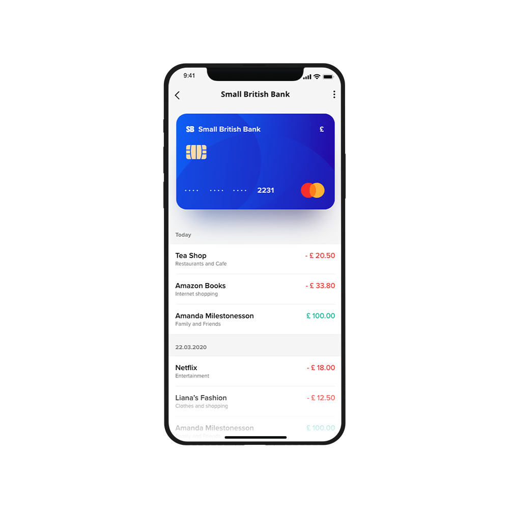
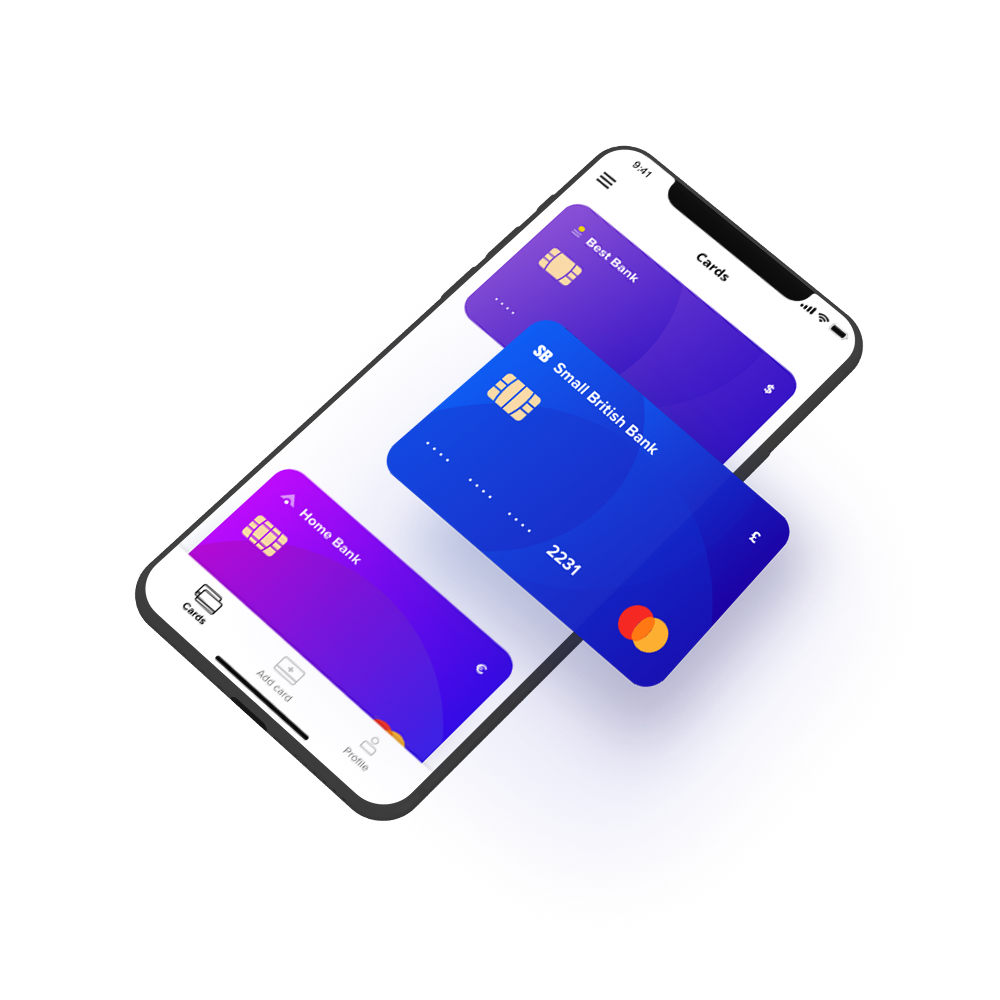

---
team_members:
  - mateusz
our_service:
  - mobile app development
  - custom software development
layout: project
project_id: card-reader
title: Card Reader
image: /images/card_reader_mockup.png
description: A fintech iOS and Android application that allows businesses to
  charge credit cards without a payment terminal.
hero_image: /images/case_study_card_reader_fintech_app.png
Hero Image_alt: Card reader
social_media_previev: /images/cardreader_fb_preview.png
social_media_previev_alt: Card Reader case study
bar_achievements:
  - number: "2"
    label: mobile apps
  - number: "6"
    label: key features
  - number: "2"
    label: iOS and Android apps
tags:
  - mobile app
  - customized software
  - fintech
title_team: team
title_case_study: more case studies
title_contact: let's talk about your product
description_contact: Tell us more about your mobile project or idea for an app.
  Fill out the form below and we'll get back to you in 48 hours.
slug: credit-card-reader
show_team: false
show_case_study: true
show on homepage: false
published: true
language: en
---
<TitleWithIcon sectionTitle='main features' titleIcon='/images/main_features_icon.png' titleIconAlt='Main features of BrightTreasury:' />

* Integration with an external card reader
* Card scanning (magnetic stripe reader)
* Card scanning and automatic data recognition (based on the card’s photo)
* Card charging
* Sending the bill/invoice to the customer’s email address
* Transaction history

<TitleWithIcon sectionTitle='intro' titleIcon='/images/three_flags.svg' titleIconAlt='intro' />

Despite the high demand for cashless transactions, not all companies worldwide have access to or can afford to use payment terminals. For instance, while the above payment methods are ubiquitous in Europe, they are far less common in countries such as Israel. In order to bridge this gap on the Israeli market, our client decided to develop a mobile app that would allow businesses to accept card payments without a physical terminal.

<AnchorLink href='#contactForm' text='let’s talk about your project'/>

<TitleWithIcon sectionTitle='goal' titleIcon='/images/goal_title_section.png' titleIconAlt='goal' />

Our client, a company that operates on the Israeli market, reached out to us with the goal of developing an iOS app for their payment service. The objective was to allow users to accept credit card payments without a physical terminal. 

When we first started our cooperation, the clients already had an up-and-running backend for the service, as well as a design for the intended interface. All they needed was to bring the mobile app to the market.

The goal was to allow the end-user to attach a separate device to their phone via a mini-jack or lightening/USB-C, that would allow reading the data stored on the card’s magnetic stripe.  This required the right technical approach towards decoding the information stored on the card.

*It is not a real implemented design. It is a mockup example created for the purpose of case study.*

<TitleWithIcon sectionTitle='process' titleIcon='/images/gearwheel.svg' titleIconAlt='process' />

Initially, Bright Inventions was entrusted with the development of the iOS app only. However, as we proceeded with our cooperation, we have also been assigned with bringing the Android app to the market.

While the external device for credit card scanning was chosen by the client, it was our responsibility to solve the issues with the device’s SDK – namely, it refused to work on the newest operating systems. Another obstacle was that the application was developed at the exact time when the newest iPhones premiered without an audio jack, which meant we needed to develop a lightning jack module.

The third challenge our mobile app developers tackled was ensuring that the app operated properly in Hebrew, i.e., in a right-to-left (RTL) language. This was especially important when it came to critical transaction data, such as properly displaying the amount charged.

*It is not a real implemented design. It is a mockup example created for the purpose of case study.*

<AnchorLink href='#contactForm' text='let’s talk about your project'/>

<TitleWithIcon sectionTitle='result' titleIcon='/images/results_icon_title_small.png' titleIconAlt='result' />

The application was successfully delivered and launched in both Google Play and the iOS App Store. The app is present on the market and used by a whole range of customers, however, new features aren’t being currently developed.
