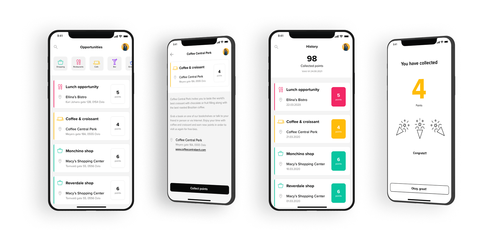
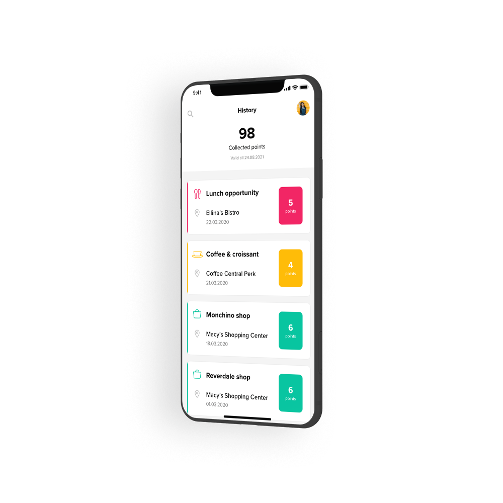

---
team_members:
  - michal
our_service:
  - mobile app development
layout: project
project_id: easytapp
title: EasyTapp
image: /images/easytap_1_mockup1.png
description: An app that allowed users to receive real estate and car sales’
  offers based on their real-time location.
hero_image: /images/case_study_real_estate_app.png
Hero Image_alt: Real estate app
social_media_previev: /images/easytapp_fb_preview.png
social_media_previev_alt: EasyTapp
bar_achievements:
  - number: "2"
    label: iOS and Android apps
  - number: "3"
    label: Key features
tags:
  - mobile app
  - customized software
  - bluetooth
  - startup
title_team: team
title_case_study: more success stories
title_contact: let's talk about your app
description_contact: Book a free consultation in 48 hours!
order: 99
slug: easytapp
show_team: false
show_case_study: true
show on homepage: false
published: true
language: en
---
<TitleWithIcon sectionTitle='main features' titleIcon='/images/main_features_icon.png' titleIconAlt='Main features' />

* Browsing through residential and car listings (with photos)
* Defining search parameters for items and locations
* Adding real estate and automotive listings to users’ ‘Favourites’ lists

<TitleWithIcon sectionTitle='intro' titleIcon='/images/three_flags.svg' titleIconAlt='about' />

EasyTapp was an iOS and Android app that allowed users to browse through real estate and automotive listings. The app triggered push notifications on users’ phones in real time, as they were passing by a residential property or car that were up for sale.

*It is not a real implemented design. It is a mockup example created for the purpose of case study.*

<TitleWithIcon sectionTitle='goal' titleIcon='/images/goal_title_section.png' titleIconAlt='goal' />

When Bright Inventions first started working on the project, the company already had an operational backend and ready-to-implement designs for the user interface. They now needed a reliable mobile development partner to bring their iOS and Android apps to life. 

Firstly, the goal was to allow users to browse through, filter, and save car and real estate listings to their ‘Favourites’ lists. Secondly, EasyTapp founders wanted to help sellers bring attention to their offers by leveraging user location data. Namely, they wanted the app to trigger push notifications on users’ screens, informing them that they were in the vicinity of a car or real estate that were up for sale on the EasyTapp platform.

*It is not a real implemented design. It is a mockup example created for the purpose of case study.*

<AnchorLink href='#contactForm' text='let’s talk about your project'/>

<TitleWithIcon sectionTitle='process' titleIcon='/images/gearwheel.svg' titleIconAlt='process' />

The key challenge Bright Invention developers had to face was finding a technological solution that would allow the app to synchronize effortlessly in the background without draining the device’s battery (as it’s often the case if location data is enabled in the background). For this reason, our experts decided to bet on iBeacon technology. If a seller purchased an iBeacon device, they would have been able to trigger automatic notifications on potential buyers’ screens, as they passed by the car or property. Such an approach was  much more efficient and battery-friendly compared to the GPS-based alternative.

<AnchorLink href='#contactForm' text='let’s talk about your project'/>

<TitleWithIcon sectionTitle='result' titleIcon='/images/results_icon_title_small.png' titleIconAlt='result' />

The application was successfully finalized and launched in Google Play and the iOS App Store. As of late-2020, the app was no longer being maintained and has been withdrawn from both app stores.
