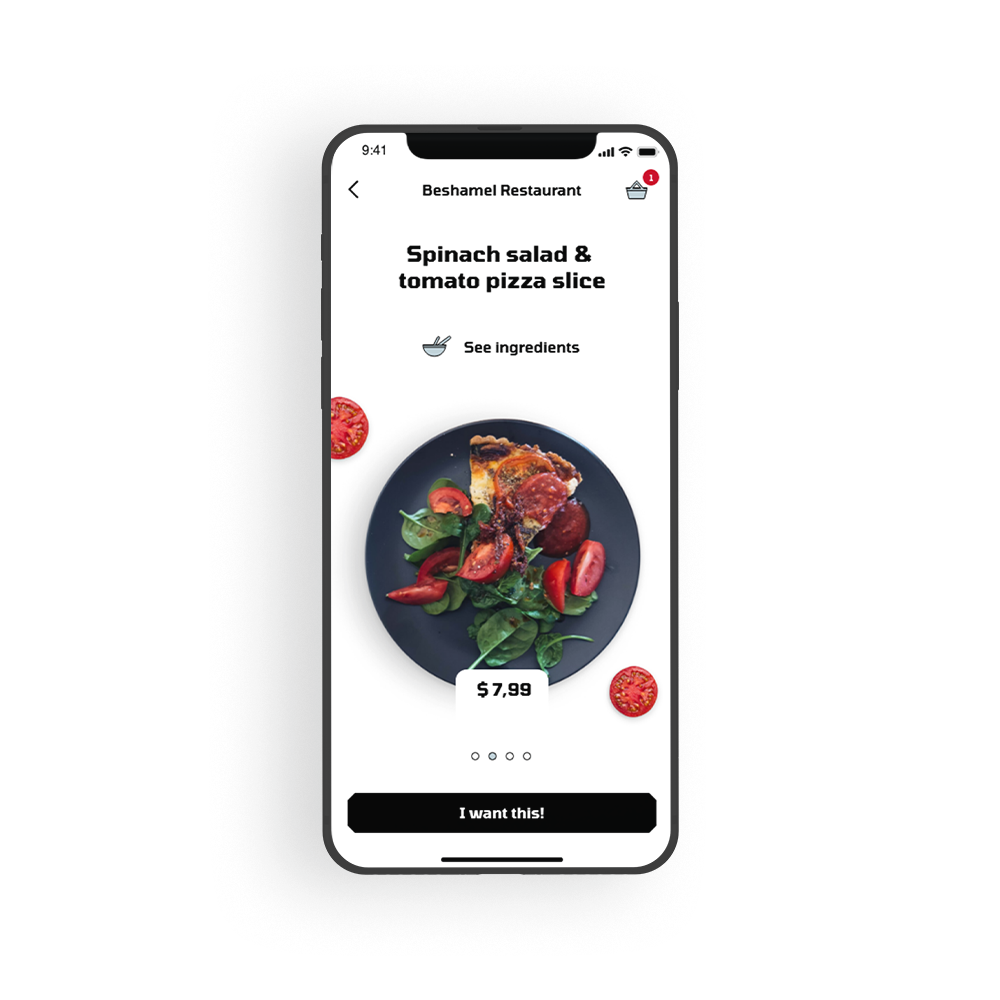
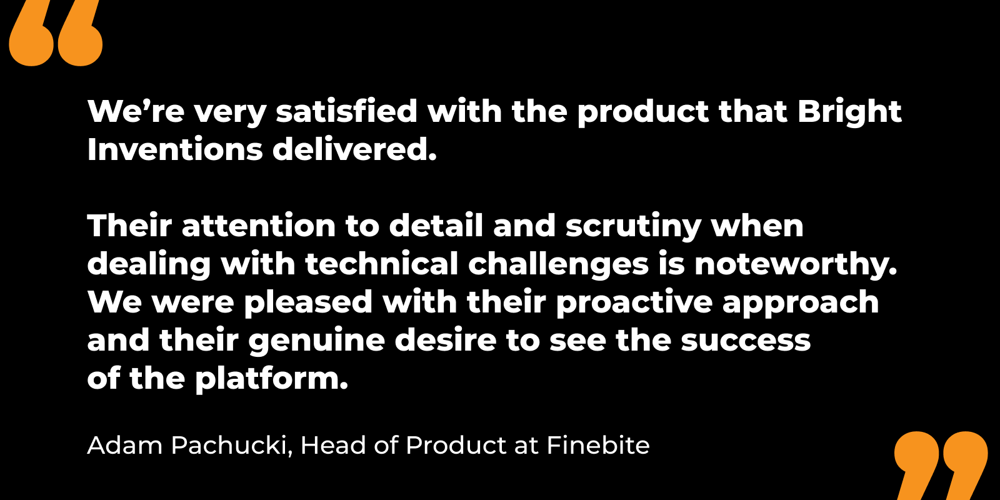
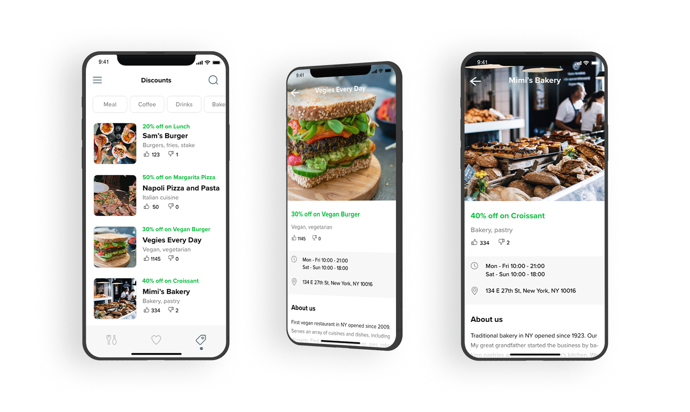
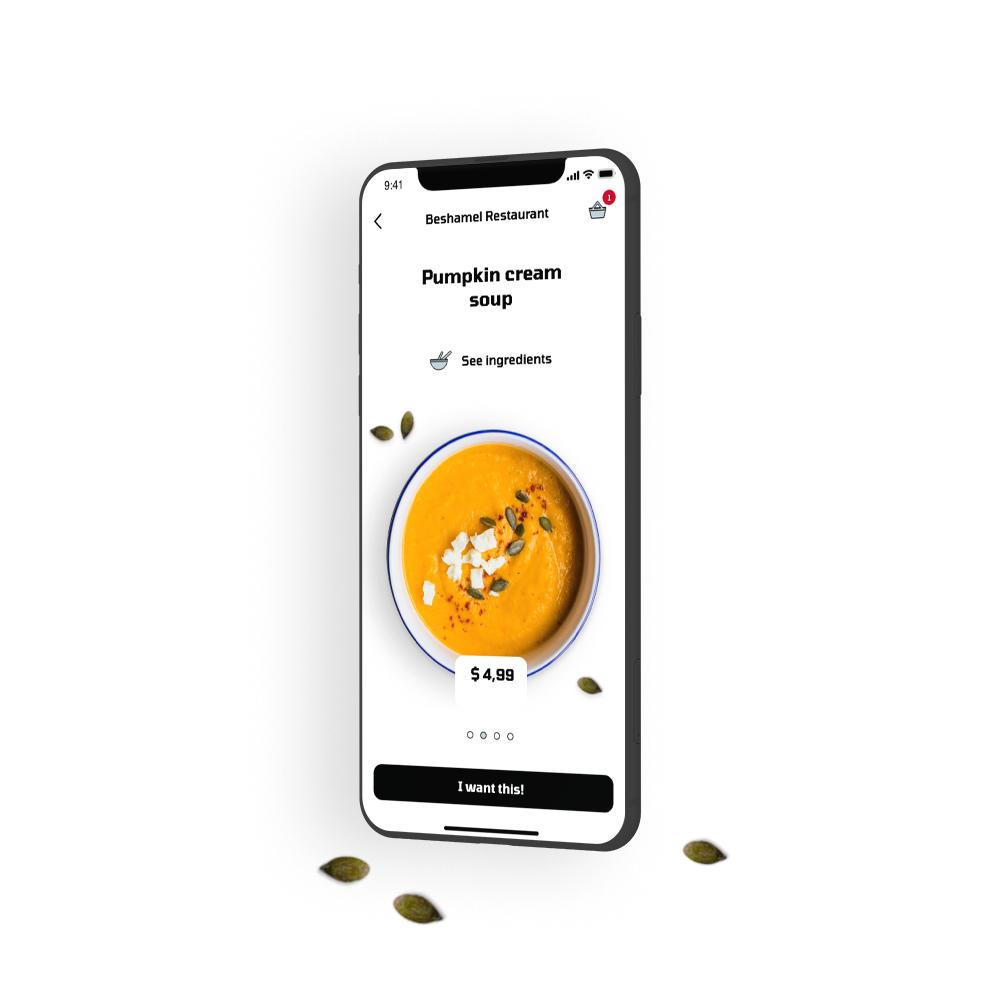

---
team_members:
  - arturs
  - mateusz
  - kasia
  - michal
our_service:
  - mobile app development
  - custom software development
layout: project
project_id: finebite
title: "Finebite (Everytap) "
image: /images/foodapp_ingredients.png
description: Finebite app helps to discover the best restaurants in the biggest
  Polish cities. Finebite originated from a very popular loyalty app – Everytap.
hero_image: /images/case_study_dining_booking_app.png
Hero Image_alt: "Finebite (Everytap) "
social_media_previev: /images/finebite_fb_preview.png
social_media_previev_alt: Finebite (Everytap) case study
bar_achievements:
  - number: "2"
    label: iOS and Android apps
  - number: 100k
    label: Downloads on Google Play
  - number: "500"
    label: Restaurants
tags:
  - mobile app
  - customized software
  - retail & restaurant
  - startup
title_team: team behind the solution
title_case_study: more success stories
title_contact: let's talk about your app
description_contact: Contact us and we'll get back to you within 48 hours!
order: 99
slug: everytap
show_team: true
show_case_study: true
show on homepage: false
published: true
language: en
---
<TitleWithIcon sectionTitle="main Finebite tech elements:" titleIcon="/images/main_features_icon.png" titleIconAlt="Main features of BrightTreasury:" />

* Highly polished user interface
* Integration with restaurants management systems
* Integration with online payment platform with 3DS
* In-depth user behaviour analytics
* A/B testing

<TitleWithIcon sectionTitle="about Finebite" titleIcon="/images/three_flags.svg" titleIconAlt="about Finebitey" />

Let’s be honest – halfway through the working day, we all have the same recurring thoughts on our minds: “time for lunch!”.

However, if you haven’t come prepared with your own meal, you might also have to decide where to head out for lunch in the first place.

The same goes for spending an evening out in town – where should you head over to with your friends to grab a bite (and a fulfilling one, at that!)?

Everytap and Finebite, two restaurant loyalty and reservation apps for iOS and Android, were designed to make finding the answer to these questions just a few clicks away.

Since Everytap first launched in 2014, it has steadily transformed from a restaurant loyalty app into a much more sophisticated platform – thus paving the way for its younger counterpart, Finebite.

Bright Inventions has worked on the ideation and development of both platforms, as discussed below.

*It is not a real implemented design. It is a mockup example created for the purpose of case study.*

As of late 2019, the service is present in 3 countries – 7 biggest cities in Poland, as well as Berlin and Lviv, and features over 400 partner restaurants.

Apart from an online reservation feature, Finebite also currently offers a truly unbeatable perk – 50% off the entire menu in return for an online review or filling in a restaurant survey. This, in turn, lets restaurants acquire more guests during off-peak hours, receive more reviews, and collect feedback privately.

Now, if that doesn’t make you feel a sudden urge for dining out, we don’t know what does!

<AppStore googleApp='https://play.google.com/store/apps/details?id=com.everytap' srcGoogle='/images/google_play.png' altGoogleImage='Finebite Google Play' appStore='https://apps.apple.com/app/id894593031' srcAppStore='/images/app_store.png' altAppStoreImage='Finebite App Store' />

<TitleWithIcon sectionTitle="goal" titleIcon="/images/goal_title_section.png" titleIconAlt="goal" />

Bright Inventions has been a partner of Everytap and Finebite from the company’s early days. Throughout the years, we helped ideate, develop, and rebuild the app from scratch and turn its first version, Everytap, into a whole new service – Finebite.

Back in 2014, the founders have entrusted us with developing an app that would revolutionize the way restaurant visitors participate in loyalty programs, and encourage them to dine out more frequently. Initially known as Everytap, the service was to substitute physical discount cards with a more visually-appealing, interactive alternative that would let them collect points/stamps in the app.

With this idea in mind, the founders have asked for our assistance in verifying the concept against the market and building two native apps for iOS and Android. The app was to leverage users’ geolocalization to show personalized deals at nearby restaurants and allow them to collect loyalty points upon payment.

*It is not a real implemented design. It is a mockup example created for the purpose of case study.*

<AnchorLink href='#contactForm' text='let’s talk about your project'/>

<TitleWithIcon sectionTitle="process of Finebite development" titleIcon="/images/gearwheel.svg" titleIconAlt="process of developing Finebite" />

We worked with the Everytap team to establish how their potential customers’ needs and benefits – both those of restaurant-goers and restaurant owners – could be best addressed.

Once we made sure both target user groups could genuinely benefit from using the app, we moved on to defining its technical requirements. Apart from deciding on the technology used for the two mobile apps and backend, we also had to tackle the challenge of integrating a solution that would leverage users’ geolocation. This was necessary for the functioning of two key features of the app – loyalty points’ collection and redeeming special offers.

We knew that we needed to integrate the app not only with Google Maps and Facebook but also with a technology that would trigger location-based push notifications on screen.

We decided to turn to iBeacon – a Bluetooth-based technology. For this purpose, we integrated with an iBeacon service offered by [Estimote](https://estimote.com/). Once introduced into the app, it became possible to trigger notifications to users as they entered or passed restaurants. iBeacon technology also enabled users to collect and spend points at partner venues via the app.

For backend, our developers chose Ruby-on-Rails – specifically, they worked with MongoDB and Heroku. The product design team was also engaged in the process – we equipped the app with plenty of custom animations and UI effects, designed to help navigate the app.

<AnchorLink href='#contactForm' text='let’s talk about your project'/>

<TitleWithIcon sectionTitle="launch" titleIcon="/images/gearwheel.svg" titleIconAlt="launch" />

The app first launched in the Apple Store and Google Play stores in 2014 and gained significant popularity across Poland. The Everytap team was, however, well aware that they could not rest on their laurels if they wanted to remain competitive to its users for years to come.

Since the app’s launch, the Everytap team kept close track of app store reviews and feature requests so that they could drive customer-inspired changes. They have also ongoingly worked on optimizing the business model so that it remained attractive to restaurants.

And so, step by step, the app transformed from a service offering promotional offers and loyalty points’ collection to one that let its users dine for half the price and book tables online. Restaurants have also been given the possibility to run multiple offers in the app (whereas, in its early day, Everytap offered just one a day).

Eventually, the Everytap team also decided to drop iBeacon technology. Namely, ever since the online reservation panel had been introduced, users passing near restaurants stopped being the target group.

While Everytap founders hit the jackpot with these changes, they weren’t entirely satisfied with where it took the overall UX, stability, and performance of the app.

And so, they have reached out to us with a radical decision – they have decided to bid farewell to Everytap and turn it into Finebite, a sophisticated, robust restaurant platform. For this to happen, the app needed to be either significantly rebuilt, or created from scratch.

Given Everytap’s technology debt, we agreed that the second option was the best direction to go.

And so, our teams have once again joined forces to bring Finebite to the market.

From a technological standpoint, the key difference between both apps was that we chose not to reuse the same technologies. And so, for Finebite we decided to drop Java in favor of Kotlin (Android) and substituted Objective-C with Swift (iOS).

From a user’s perspective, the app is now much more intuitive, features a cohesive design, and offers top-notch performance.

*It is not a real implemented design. It is a mockup example created for the purpose of case study.*

<TitleWithIcon sectionTitle="client’s perspective" titleIcon="/images/clients_perspective_icon.svg" titleIconAlt="client’s perspective" />

*They kept us in the loop at all times and provided updates and progress reports on a weekly basis. They were also very accessible, and interactions between our designers and their developers were productive. They made us feel like we were one cohesive team, even going so far as to build a workstation at their office for our lead backend developer.*

**Adam Pachucki, Head of Product at Finebite**

<TitleWithIcon sectionTitle="result" titleIcon="/images/results_icon_title_small.png" titleIconAlt="result" />

During the past 5 years, the app has evolved from a loyalty program service to a sophisticated reservation and customer review platform. Finebite has been steadily growing and expanding to new markets.

Users admit that Finebite is a true bridge between the world of new technologies and the traditional dining experience. They also admit that the app encourages them to dine out more frequently and share their feedback with restaurants and the diners’ community. In the words of one of its users, Finebite “is a very cool option for regular diners as well as an encouragement to try something new. In general, one of the most sophisticated Android applications”.
