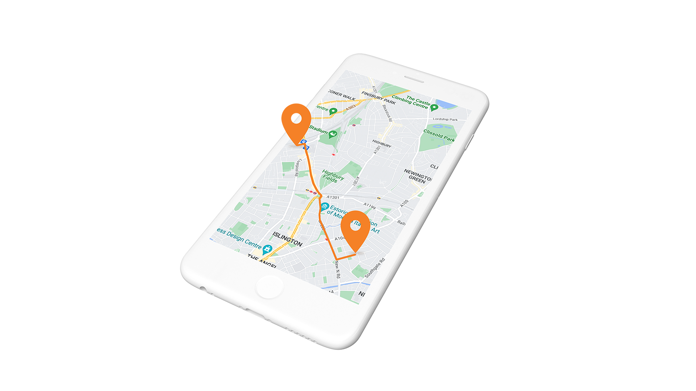
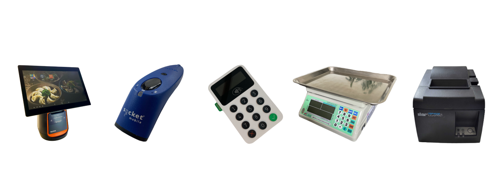

---
team_members:
  - azabost
  - fjablonski
  - marta
  - szymek
our_service:
  - MVP development
  - mobile app development
layout: project
project_id: Practi JET POS Mobile
title: Retail iOS and Android Apps with Bluetooth Integration – Just Eat POS
image: /images/mobile_retail_app_cover.png
description: Just Eat POS was a retail system available on iOS and Android used
  by restaurants in Israel and the UK. We scaled this project from the startup
  phase to a fully developed global solution.
hero_image: /images/case_study_mobile_retail_epos.png
Hero Image_alt: Mobile Apps for Restaurant System
social_media_previev: /images/fb_preview_mobile_just_eat_pos.png
social_media_previev_alt: Just Eat POS Mobile
bar_achievements:
  - number: "9"
    label: years of cooperation
  - number: 10+
    label: apps in the system
  - number: 100+
    label: features created
tags:
  - mobile app
  - customized software
  - retail & restaurant
  - bluetooth
  - fintech
title_team: team behind the project
title_case_study: more success stories
title_contact: let's talk about your solution
description_contact: Book a free consultation in 48 hours.
order: 7
slug: system-for-restaurants-mobile
show_team: true
show_case_study: true
show on homepage: false
published: true
work_in_progress: false
language: en
---
<TitleWithIcon sectionTitle="Just Eat POS restaurant system" titleIcon="/images/icon_title_about.svg" titleIconAlt="about" />

Just Eat POS system took care of the whole process of managing restaurant orders: from ordering the meal, providing kitchen staff with details to delivering the order to the client’s table or home. A huge part of the system was a couple of Android and iOS applications.

Also, read another [Just Eat POS case study](/projects/system-for-restaurants) about other products built for this enormous system.

<TitleWithIcon sectionTitle="mobile apps integrated with restaurant and retail systems" titleIcon="/images/icon_title_products.svg" titleIconAlt="Apps" />

* ePOS iOS and Android **applications used by restaurant staff** to take orders and manage payments.
* iOS and Android **driver application** which assists drivers in delivering orders.

*It is not a real implemented design. It is a mockup example created for the purpose of a case study.*

<TitleWithIcon sectionTitle="stack and skills:" titleIcon="/images/skills.svg" titleIconAlt="features" />

<Gallery images='[{"src":"/images/kotlin_new_stack_logo.svg","alt":"Kotlin"},{"src":"/images/swift_icon_stack.svg","alt":"Swift"},{"src":"/images/firebase_logo_stack.png","alt":"Firebase"},{"src":"/images/realm_stack_logo.png","alt":"Realm"},{"src":"/images/fastlane_logo_stack.png","alt":"Fastlane"}]' />

**technologies:** Kotlin, Coroutines, Realm, ReactiveSwift, Firebase, Google Maps, Dagger 2, Fastlane

<AnchorLink href='#contactForm' text='let’s talk about your project'/>

<TitleWithIcon sectionTitle="iOS development" titleIcon="/images/gearwheel.svg" titleIconAlt="iOS development" />

iOS products developed by our team were used in restaurants in Israel. Practi iOS solution was one of the top ePOS solutions used by restaurants in Israel. There were **three main retail products developed by bright iOS developers**.

### **Reggie iOS ePOS application**

**Reggie was “the mind” of the whole ePOS system at the restaurant**. It was a cash register itself. It was fully integrated with JustEat and a couple of other online food delivery companies. You could manage orders from clients in the restaurant as well as took care of all phone and internet orders. Also, the app enabled you to manage drivers if the restaurant hired them.

### **Click & Collect – iOS white label application**

**The app was dedicated to restaurants which want to offer clients their own meal-ordering application**. “White label app” was the product that can be easily adjusted to clients brand visual identity and business needs. Therefore every restaurant can use this app but it looks differently for every business. The app allowed restaurant’s customers to order items from menu and get them delivered or collected on their own.

### **Driver app** 

Our team also developed an independent **product used by drivers who deliver the orders from a restaurant to customers**. The app not only showed the destination and navigates drivers but also kept them informed about the transaction details. Drivers knew whether the order was paid or it needed to be paid. The driver was well-aware about the payment method (by cash or card). Thanks to the app, drivers were provided with all necessary information and could focus on delivering the meals as soon as possible.

<TitleWithIcon sectionTitle="Android development" titleIcon="/images/gearwheel.svg" titleIconAlt="Android development" />

Android development team delivered similar solutions to the iOS team. Android app was used by end-users in the UK.

### Reggie Android ePOS application

The app let you manage food orders made at restaurant, by phone or the website.

**Some of the features of the Android Just Eat POS application are:**

* **Catalog** – the main screen of the app used to quickly set up orders taken at place (in person). The cashier or other stuff member had access to all menu items and could choose the ones a client wanted to order. They couldan also choose the delivery option if needed and enter client’s data. Then a cashier could proceed to the transaction.
* **Customer Orders** – the dashboard displaying all orders made externally – via a phone or online food delivery providers like Takeaway, Just Eat, etc. So these were orders that weren't made in person. The app user could quickly check the status of every order and assign a driver to deliver it to the customer.
* **Reports** – the app displayed various data and statistics that showed your company revenue, number of orders and sold items, details about the inventory and more.
* **Printing receipt** – the app enabled to print payment receipts as well as receipts printed in the kitchen with details about the order.
* **Integration with CallerID** – when a client called, the application assigns the caller number with the order.

<AnchorLink href='#contactForm' text='let’s talk about your project'/>

<TitleWithIcon sectionTitle="customized applications for Bluetooth devices" titleIcon="/images/gearwheel.svg" titleIconAlt="delivering customized applications for Bluetooth devices" />

A great part of working with Just Eat POS was **building iOS and Android applications integrated with Bluetooth retail and ePOS devices** including:

* POS Desktops,
* Payment terminals,
* Magnetic stripe readers,
* Label and thermal printers, 
* Caller ID hardware, 
* Kitchen Display Systems,
* Electronic scales,
* Barcode scanners,
* Kiosks.

Our applications had been integrated mostly with **Sunmi Technology** – one of the top global hardware providers.

<TitleWithIcon sectionTitle="what is next for Just Eat Takeaway and Bright Inventions" titleIcon="/images/icon_result_svg.svg" titleIconAlt="result" />

Just Eat POS (prev. Practi) and Bright Inventions have established a long-term business relationship and our team proudly collaborates with **Just Eat Takeaway on retail solutions**.