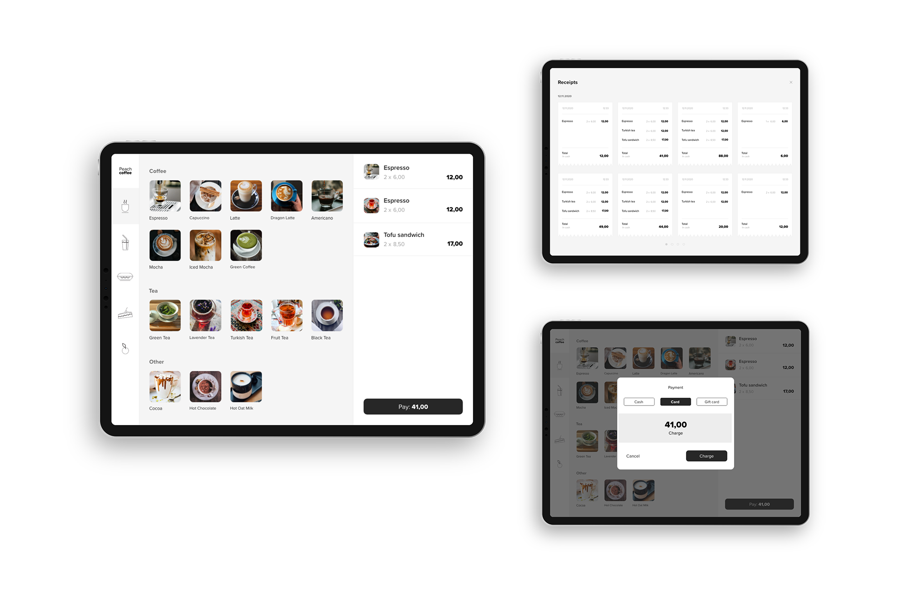
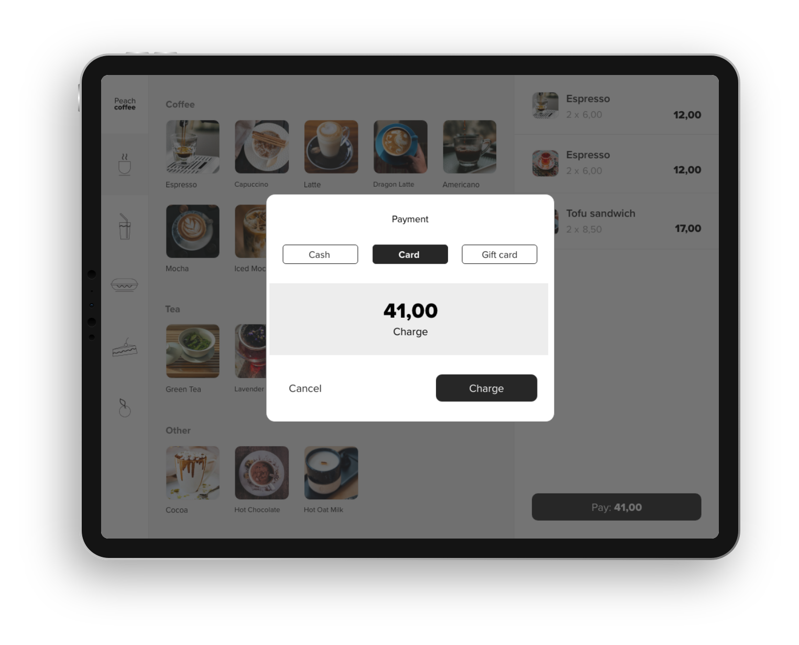
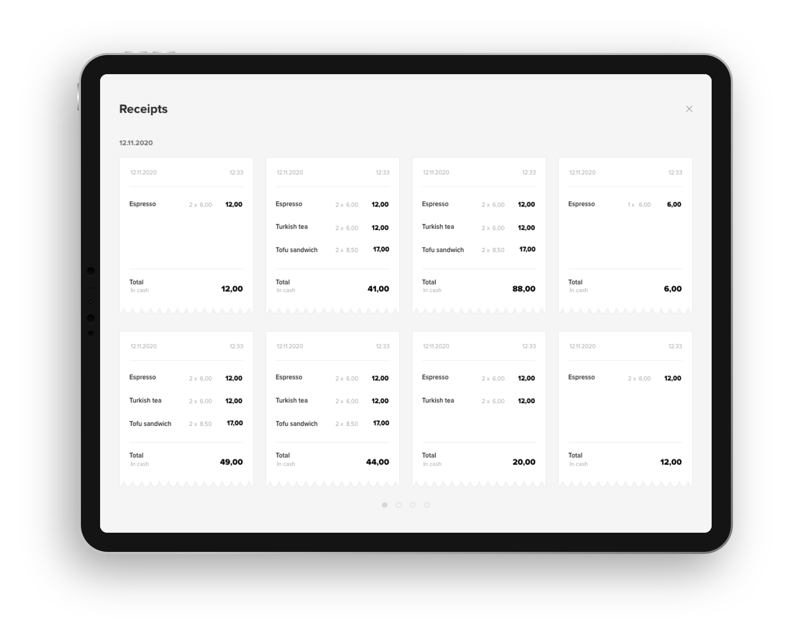
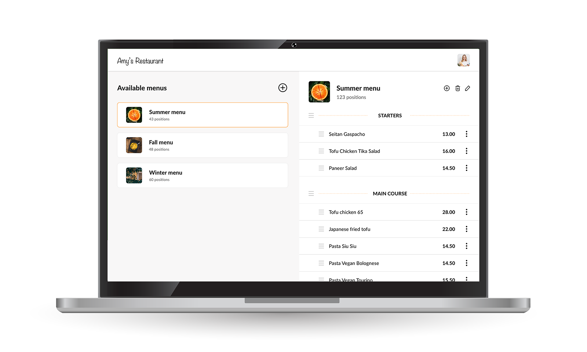

---
team_members:
  - bartosz
  - jedrzej-s
  - malgorzata-z
  - maciej-n
  - karol r
  - piotr
  - radek-l
  - bartek k
our_service:
  - MVP development
  - web development
layout: project
project_id: Practi JET POS
title: Just Eat POS – System for Restaurants
image: /images/restaurant_system_cover.png
description: Just Eat POS was a retail system used by restaurants in Israel and
  the UK. We worked on this project for almost a decade.
hero_image: /images/case_study_pos_solution.png
Hero Image_alt: Just Eat POS
social_media_previev: /images/restaurant_system_preview.png
social_media_previev_alt: Just Eat POS
bar_achievements:
  - number: "9"
    label: Years of cooperation
  - number: "8"
    label: Teams from Bright Inventions
  - number: 100+
    label: Features built
tags:
  - web app
  - customized software
  - mobile app
  - retail & restaurant
  - fintech
  - enterprise
title_team: team behind the project
title_case_study: more success stories
title_contact: let's talk about your product
description_contact: Tell us more about your mobile project. Fill out the form
  below and we'll get back to you in 48 hours.
order: 3
slug: system-for-restaurants
show_team: true
show_case_study: true
show on homepage: false
published: true
language: en
---

*It is not a real implemented design. It is a mockup example created for the purpose of a case study.*

<TitleWithIcon sectionTitle='main products developed for Just Eat POS:' titleIcon='/images/icon_title_products.svg' titleIconAlt='applications' />

**Just Eat POS system took care of the whole process of managing restaurant orders: from ordering the meal, providing kitchen staff with details to delivering the order to the client’s table or home**. It also supported daily running of the restaurant by managing employees time, creating menus or providing tools to build their own restaurant website.

<TitleWithIcon sectionTitle='the system was built around these products:' titleIcon='/images/icon_title_products.svg' titleIconAlt='applications' />

* **[ePOS iOS and Android applications](/projects/system-for-restaurants-mobile)** used by restaurant staff to take orders and manage payments.
* **White label application for restaurants** to take orders via their own, dedicated website.
* **iOS and Android driver applications** which assisted drivers in delivering orders.
* A **website that enabled to display restaurant’s menu** and offered integrations with online delivery providers like JET or Wolt.
* **Backoffice solutions** including managing integrations and API connections.

<TitleWithIcon sectionTitle='main features developed by Bright Inventions:' titleIcon='/images/icons_features_svg.svg' titleIconAlt='features' />

<SliderText sliderElements='[{"title":"Food ordering management","description":"Taking care of the whole process from ordering the meal to delivering the order."},{"title":"Transactions processing","description":"Including implementing offline mode, integration with payment service providers and receipt printing."},{"title":"Integrations with external systems and providers","description":"Integration with payment service providers as well as online food delivery services."},{"title":"Integration with online food delivery services","description":"Easy management of orders from different platforms in one device. "},{"title":"Team management and tracking","description":"Employees time tracking, managing team roles e.g. cashier, manager etc. Delivery tracking."},{"title":"Supply management","description":"Inventory management and supply ordering."},{"title":"Analytics","description":"Business analytics platform reporting sales and financial information."}]' />

*It is not a real implemented design. It is a mockup example created for the purpose of a case study.*

<TitleWithIcon sectionTitle='Bright Inventions’ technology stack and skills:' titleIcon='/images/skills.svg' titleIconAlt='stack' />

<Gallery images='[{"src":"/images/react.png","alt":"React"},{"src":"/images/new_typescript_logo_stack.png","alt":"TypeScript"},{"src":"/images/kotlin.png","alt":"Kotlin"},{"src":"/images/aws.png","alt":"AWS"},{"src":"/images/firebase_logo_stack.png","alt":"Firebase"},{"src":"/images/realm_stack_logo.png","alt":"Realm"},{"src":"/images/fastlane_logo_stack.png","alt":"Fastlane"}]' />

**Frontend**: React, TypeScript, React Query, Formik, Storybook, Nx, React Testing Library, Styled Components, Styled System, Mock Service Worker (MSW), Zustand.

**Backend**: Kotlin, Spring Boot, AWS Aurora (MySQL), Redis, hosted on AWS ECS.

**Android**: Kotlin, Coroutines, Android Architecture Components (LiveData, ViewModel, Room, Navigation, Paging), Firebase, Google Maps, Dagger 2, Robolectric and other Google APIs

**iOS**: Realm, ReactiveSwift, PureLayout, MixPanel, Alamofire, Fastlane, Firebase

**Data Analysis**: Redshift, Tabaloo

<AnchorLink href='#contactForm' text='let’s talk about your project'/>

<TitleWithIcon sectionTitle='about Just Eat POS and Bright Inventions cooperation' titleIcon='/images/icon_title_about.svg' titleIconAlt='about BrightTreasury' />

The client reached out to us in **2013**. At that time it was an early-stage Israeli startup “Practi” that offered web application solutions to users. Since 2013 **the company has transformed from a promising startup to an international ePOS applications provider**.

In 2019 Practi was **acquired by Just Eat Takeaway**. **Bright Inventions had a great opportunity to assist the client** during this incredible ride, including the whole business transformation.

<TitleWithIcon sectionTitle='client’s expectations' titleIcon='/images/clients_perspective_icon.svg' titleIconAlt='Client’s expectations' />

The client expected us to actively take part in creating the whole system. We were not only “code suppliers”, **we were technical partners offering years of software development experience**. Our mobile and web knowledge, and the fact that we hadve been working on this system since 2013 enabled us to evaluate technical and business decisions. As a result, when needed, we gladly offered alternative solutions that would benefit the client and end-users.

<TitleWithIcon sectionTitle='challenges and goals' titleIcon='/images/icon_title_goal.svg' titleIconAlt='goal' />

Just Eat POS system (prev. Practi) was a product with over 10 years of history. It was built as a startup solution for a small group of clients with specific needs. The system became a part of the Just Eat Takeaway's family. 

Therefore **scalability was the key**. Our teams took care of rebuilding some applications to make them more accessible for a growing number of users.

The increasing number of users also meant that **Bright Inventions’s team had to actively monitor services, especially metrics such as CPU usage, number of database connections and average response time**. The goal was to predict and solve any potential issues before they could affect clients.

*It is not a real implemented design. It is a mockup example created for the purpose of a case study.*

<AnchorLink href='#contactForm' text='let’s talk about your project'/>

<TitleWithIcon sectionTitle='process of building Just Eat POS retail system' titleIcon='/images/gearwheel.svg' titleIconAlt='process of developing BrightTreasury' />

All Bright Inventions’ developers worked closely with the business side. Bright Inventions’s was represented by 8 development squads (each squad had about 5 developers and 2 dedicated QA engineers) who took care of various areas of this massive hospitality system. Let us show you some of the development teams.

Read about iOS and Android development teams's products in a [Just Eat POS mobile applications case study](/projects/system-for-restaurants-mobile).

### Frontend team

One of Bright Inventions Frontend team **priorities was the development of the Just Eat POS Backoffice**. This was a web application that enabled managing business daily activities and gave access to financial reports. 

**Here are examples of many features of the Just Eat POS Backoffice:**

* Dashboard with all necessary information that shows the financial condition of your restaurant.
* Restaurant menu creator.
* Establishing prices of items on a menu.
* Managing the team and adjusting their roles e.g. cashier, branch manager and more.
* Access to sales reports and other crucial business data.
  Inventory management.
* Setting up basic restaurant configurations e.g. taxes, operating hours, delivery hours, delivery charge and more.

*It is not a real implemented design. It is a mockup example created for the purpose of a case study.*

**Frontend team took an active role at every phase of frontend app development** process working closely with a product manager and product designers.

The Backoffice system had been on the market for around 10 years. Therefore one of the priorities of the frontend team was to **migrate the app to modern technology while delivering new features** to users who used this platform everyday at work. 

Thanks to the trust of the client, **the team took part in the decision-making process regarding which libraries, tools and technologies to choose** to rewrite the platform. The migration didn't include only changing to newest technologies. The essential part of it was also implementation of new designs maintaining the best possible UX and UI experience.

### Backend team

The team was responsible for maintaining and developing backend. All applications within Just Eat POS ecosystem were connected to the same backend. **The main job of backend team was delivering features, supporting any initiatives on the Just Eat POS applications.** 

It was **crucial especially in terms of white label apps where the clients incorporated changes and decided about the final look and functionalities of their app**. In this case, the backend team had to step forward and support clients with appropriate changes in backend.

Additionally, the **Backend team paid much attention to the performance**. Since all Just Eat POS apps were connected to the one shared backend, any hiccup that happens on the Backend propagated to every client, affecting UX. We relied on the observability of our services. **We tried to detect any abnormalities in the CPU usage, number of database connections or average response time to detect issues before they became visible to our customers**.

Data we stored provided our client with significant insight into the behaviour of our customers. Feeding this data into the data lake gave the data science team a way to study the customers, and helped make more meaningful, data-driven features.

### Backend integrations team

This team **took care of integrations with food delivery platforms and menu platforms**. Thanks to their work restaurants using Just Eat POS solution could change the menu in only one place and it would be automatically updated on every possible platform the restaurant used to display its menu.

Another responsibility of this team was i**ntegrations with online food order and delivery providers like Just Eat or Takeaway.** The goal of backend integrations team was to enable management of orders from different platforms in one device. So restaurant employees didn't have to use different apps and devices to take care of orders from other platforms.

<AnchorLink href='#contactForm' text='let’s talk about your project'/>

<TitleWithIcon sectionTitle='result' titleIcon='/images/icon_result_svg.svg' titleIconAlt='result' />

Just Eat POS (prev. Practi) and Bright Inventions have established a long-term business relationship. Practi was one of our first clients. **During almost a decade of our cooperation the client transformed from a startup to a global Point-Of-Sale system provider used by businesses in Israel and the UK**. 

We are honored to be their technical partner for almost a decade. Although the retail system is no longer developed **Bright Inventions team still works with Just Eat Takeaway** on other solutions.
