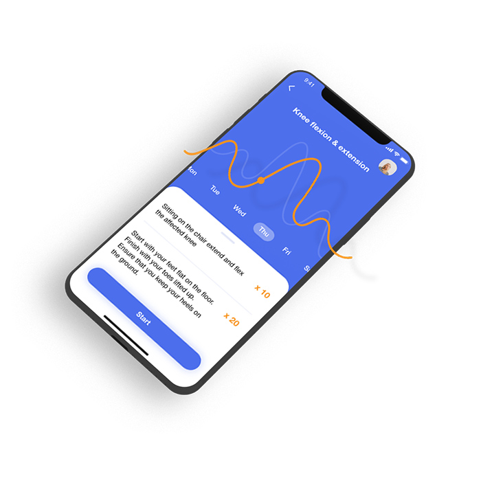

---
team_members:
  - michal
our_service:
  - mobile app development
  - MVP development
layout: project
project_id: mobile-therapy-application
title: "The Future of Physiotherapy: Engaging Patients with Mobile Application"
image: /images/mobile_therapy_app1.jpg
description: Physiotherapy holds the transformative power to improve lives,
  especially during challenging times such as recovery after a stroke. Yet its
  full potential often remains untapped. Meet the mobile application that
  supports therapists and empowers patients through their difficult journey to
  recovery.
hero_image: /images/case_study_ehealth_mobile_app.png
Hero Image_alt: Therapy app
social_media_previev: /images/therapy_fb_preview.png
social_media_previev_alt: Mobile Therapy App case study
bar_achievements:
  - number: 24h
    label: After the stroke, physiotherapy can start
  - number: "6"
    label: Months to MVP launch
  - number: "2"
    label: iOS and Android apps
tags:
  - mobile app
  - customized software
  - eHealth
title_team: team
title_case_study: more success stories
title_contact: let’s talk about your product
description_contact: Contact us and we'll get back in 48 hours.
order: 99
slug: mobile-therapy-application
show_team: false
show_case_study: true
show on homepage: false
published: true
work_in_progress: false
language: en
---
*It is not a real implemented design. It is a mockup example created for the purpose of case study.*

<TitleWithIcon sectionTitle="technologies" titleIcon="/images/skills.svg" titleIconAlt="technologies" />

<Gallery images='[{"src":"/images/swift_icon_stack.svg","alt":"Swift"},{"src":"/images/kotlin_new_stack_logo.svg","alt":"Kotlin"},{"src":"/images/node_stack_logosvg.svg","alt":"node.js"},{"src":"/images/new_typescript_logo_stack.png","alt":"TypeScript"},{"src":"/images/postgresql_logo_stack.png","alt":"PostgreSQL"},{"src":"/images/aws_stack_logo.svg","alt":"AWS"},{"src":"/images/react_stack_logo.svg","alt":"React"}]' />

**technologies:** Swift, Kotlin, Node.js, Typescript, AWS, React

<TitleWithIcon sectionTitle="problem: short and infrequent psychotherapy visits" titleIcon="/images/icon_title_about.svg" titleIconAlt="problem" />

Physiotherapy plays a crucial role in s**upporting successful recovery after discharge** from hospital care. It’s also an effective tool for **reducing the negative impacts of desk-bound work or sports injuries**.

One of the recoveries physiotherapy can deeply influence is post-stroke care. Globally, cardiovascular disease remains the leading cause of death, with stroke being a significant contributor. **Physiotherapy can start as early as 24 hours following a stroke**. **Unfortunately, in many cases, patients do not receive physiotherapy as promptly or as frequently as they should**. The critical window for maximizing recovery post-stroke is narrow, and once it closes, the optimal recovery is almost impossible.

No matter the condition a patient has, **short and infrequent psychotherapy visits probably won't solve their issues**. The key is to continue the work at home. **What if technology could support patients and therapists to harness the potential of physiotherapy** by motivating patients to exercise at home and streamlining therapists' workflows to give them more time for personalized patient care?

*It is not a real implemented design. It is a mockup example created for the purpose of case study.*

<TitleWithIcon sectionTitle="solution: mobile app engaging physiotherapy patients" titleIcon="/images/gearwheel.svg" titleIconAlt="solution" />

**Our client, a digital agency and an early-stage project incubator based in Germany**, has turned to us with a ready-to-implement idea for a healthcare app. Before reaching out to us, **they had already spent over 300 hours validating their concept** by observing physiotherapy sessions. This resulted in a comprehensive plan for an app that would solve the biggest challenges patients and therapists face, including limited time therapists have for each patient, patients not exercising regularly, and performing some exercises incorrectly at home.

**Our client entrusted us with the implementation of the entire system comprised of iOS and Android applications and the backend**. We also crafted separate modules for patients and therapists.

On the patient profile, one could download the therapy plan, as well as use the app daily for exercise and progress tracking. **The patient’s app also featured reminders and thanks to gamification, motivated the patient to continue on their path to recovery** by displaying therapy statistics.

**The therapist panel was more sophisticated**. Firstly, it needed to allow therapists to customize plans for each patient. **The specialist could quickly make photos or videos of patients performing the exercises** and upload them to an individual patient profile, so the patient could then correctly perform the exercises at home without worrying about remembering them correctly. Therapists could also plan out exercise sessions on a calendar and include information on the number of circuits per exercise as well as other important recommendations.

*It is not a real implemented design. It is a mockup example created for the purpose of case study.*

<TitleWithIcon sectionTitle="challenges" titleIcon="/images/icon_title_goal.svg" titleIconAlt="challenges" />

One of the technical challenges was **enabling smooth video uploads of the exercise recordings**. 
Given that physiotherapists already had minimal time allocated per patient, we aimed to avoid having them spend it waiting for videos to upload. Furthermore, **we wanted to ensure they could continue using their devices without interruption while the videos were being uploaded**. Therefore, **we implemented asynchronous uploading, allowing therapists to freely continue using the phone** while the videos were uploaded in the background.

Another challenge we faced collaboratively with our client was **finding the most user-friendly way to introduce the app to patients**. As visits tend to be very short, it was crucial that the therapist and patients would be able to link their accounts in the app quickly. Naturally, only some patients already had the app when they came in, and not everyone felt comfortable with using new technologies. Low levels of tech-savviness meant it was difficult for them to download the app during the session, register an account, and – most importantly – link their profiles with those of therapists. Also, it would mean that the precious time meant for the therapy would be taken away for dealing with the new app installation.

**We solved the problem by automating the linking of patient-therapist profiles through a previously generated codes**. Therefore, the therapist could print the codes, and simply give it to the patients at the end of the session. This enabled patients to link their accounts from the comfort of their homes after the physiotherapy session was over. By inserting the code in the app, they were able to download the prescribed exercise plan.

<TitleWithIcon sectionTitle="result of collaboration: delivering a robust MVP" titleIcon="/images/results_icon_title_small.png" titleIconAlt="result" />

We delivered the Minimum Viable Product (MVP) within a six-month timeframe. Subsequently, our client opted for an external audit of the project's technical aspects, which was successfully passed. The solution has expanded, changing the physiotherapy experience for individuals across Germany. We are thrilled to contribute to the digitalization of traditional psychotherapy.