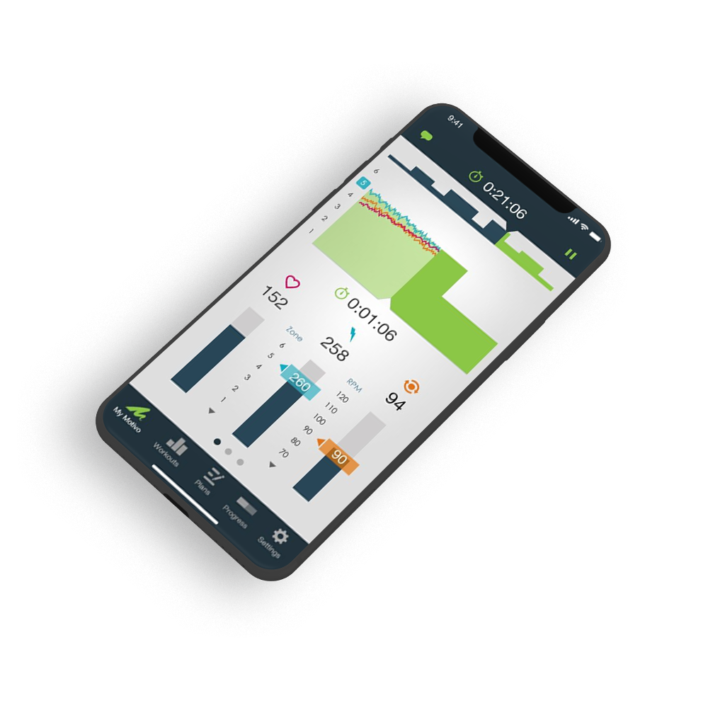
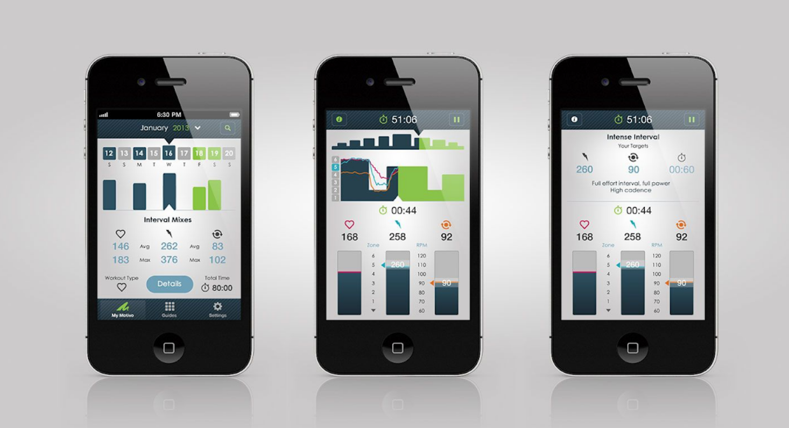

---
team_members:
  - michal
our_service:
  - mobile app development
  - bluetooth development
layout: project
project_id: motivo
title: Optimizing Cycling Training with App Integrated with Wahoo Fitness Devices
image: /images/motivo_cycling_app_case_study.png
description: Turbo Training and Indoor Cycling Workouts. The app is your own
  personal cycling coach. It offers Interactive training plans and workouts for
  indoor cycling.
hero_image: /images/case_study_sports_app.png
Hero Image_alt: Cycling app
social_media_previev: /images/fb_preview_case_study_pro_cycling_app.png
social_media_previev_alt: Motivo case study
bar_achievements:
  - number: "2013"
    label: Release date
  - number: "1"
    label: iOS app
  - number: "5"
    label: Key features
tags:
  - mobile app
  - customized software
  - bluetooth
title_team: team
title_case_study: more success stories
title_contact: let's talk about your app
description_contact: Contact us and we'll get back to you within 48 hours!
order: 99
slug: motivo
show_team: false
show_case_study: true
show on homepage: false
published: true
work_in_progress: false
language: en
---
<TitleWithIcon sectionTitle="main features" titleIcon="/images/main_features_icon.png" titleIconAlt="Main features" />

* Wahoo Fitness Integration
* Apple In app purchases
* Web purchases using Stripe
* Bespoke user interface
* Advanced animations

<TitleWithIcon sectionTitle="intro" titleIcon="/images/three_flags.svg" titleIconAlt="intro" />

When you’re a cyclist winter months is when your next season performance is decided. Give up to the elements and you’re done. Or... build your own indoor training system with Motivo. The app offers Interactive training plans and workouts for indoor cycling. Motivo makes sure you're getting the best results from a turbo training or spinning with full Wahoo KICKR Erg mode support.

<TitleWithIcon sectionTitle="goal" titleIcon="/images/goal_title_section.png" titleIconAlt="goal" />

Daniel Bachini and Alain Ritchie, two London based cycling professionals, approached Bright Inventions in the late Summer of 2014 with the idea for a mobile training platform that would help cyclists like themselves in staying fit during the off season months.

The goal was to launch a fully fledged system before the upcoming winter season after having tested the alpha and beta versions with the internal Motivo Cycling Team.

A major challenge during the development phase was to ensure seamless integration with a set of Wahoo Fitness devices ranging from the heart rate sensors, speed & power sensors to power trainers (such as Wahoo’s flagship KICKR model).

Bright Inventions was engaged in the ideation process and took full responsibility for the software part.

<AnchorLink href='#contactForm' text='let’s talk about your project'/>

<TitleWithIcon sectionTitle="process" titleIcon="/images/gearwheel.svg" titleIconAlt="process" />

A very ambitious timeline called for a highly optimised approach to the development. From the day zero a dedicated small team has been assigned to work on the Wahoo Fitness integration aspects. In parallel, two workshops with the customer representatives (held in Gdansk and London) led to the identification of the features supporting key business needs and the creation of prioritised requirements spec. It was clear from the beginning that some of the lower priority features wouldn’t make it to the first version of the product.

A semi-professional internal Motivo Cycling Team was established and tasked with testing the alpha and beta versions of the upcoming product. They took on the challenge of including the Motivo app in their daily training, often doing extra exercises just to validate the app. In retrospect, the product would have never happened if it hadn’t been for the feedback collected from the Motivo Cycling Team.

A highly iterative approach was taken with regards to user interface. Two most important screens (calendar and workout) were designed in a few different variations and the experiments conducted with the cyclist team helped decide on the one finally picked for the public release.

<AnchorLink href='#contactForm' text='let’s talk about your project'/>

<TitleWithIcon sectionTitle="launch" titleIcon="/images/results_icon_title_small.png" titleIconAlt="launch" />

The AppStore launch in January 2015 was supported by an advertising campaign that included ads in the UK sport press. A number of free subscription packages were given away as a way of enticing prospective users.

Motivo successfully filled in the niche and many amatour and semi-professinonal cyclists switched to it as their primary training tool.

More people than expected started to heavily use the workout builder in the web back office system which led to the further development of that area.

Multiple additional engagement strategies were put in place as a result of analysis of the users interaction patterns with the product.