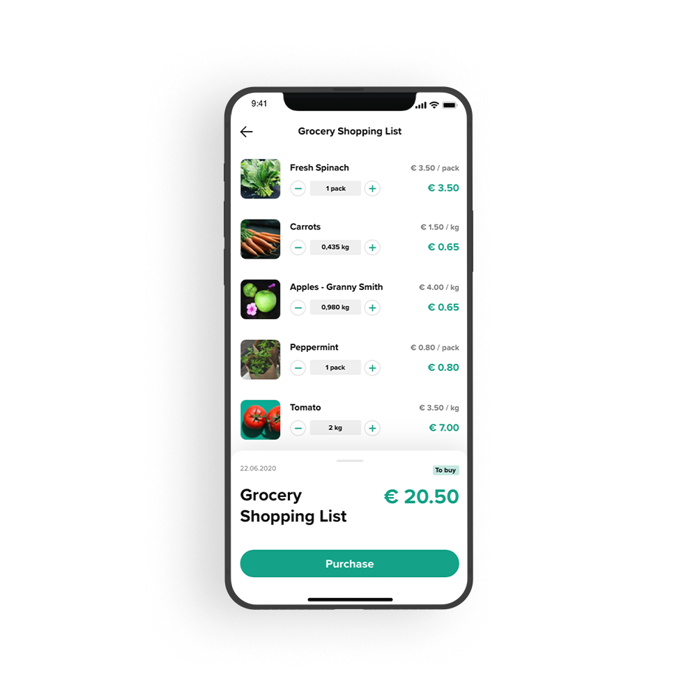

---
team_members:
  - michal
our_service:
  - mobile app development
  - web development
  - MVP development
layout: project
project_id: pospulse-shopscout
title: "ShopScout App: Perfect Mystery Shopper Experience"
image: /images/pos_mockup.png
description: A solution for FMCG companies and retail chains for verifying if
  products are properly displayed on shelves by asking consumers to perform paid
  quality checks.
hero_image: /images/case_study_retail_fmcg_app.png
Hero Image_alt: A solution for FMCG companies
social_media_previev: /images/fb_preview_case_study_shop_audit.png
social_media_previev_alt: POSPulse & ShopScout case study
bar_achievements:
  - number: 800k
    label: Active users
  - number: "2"
    label: iOS and Android apps
tags:
  - mobile app
  - customized software
  - retail & restaurant
title_team: team
title_case_study: more success stories
title_contact: let's talk about your solution
description_contact: Contact us and we will book a free consultation in 48 hours.
slug: pospulse-shopscout
show_team: false
show_case_study: true
show on homepage: false
published: true
work_in_progress: false
language: en
---
<TitleWithIcon sectionTitle="main features by Bright Inventions" titleIcon="/images/main_features_icon.png" titleIconAlt="main features" />

**POSPulse**

* Defining and publishing assignments for ShopScout app users
* Verifying the completion of assignments
* Issuing payments (rewards) for proper task completion

**ShopScout**

* Browsing through available tasks, divided into categories
* Completing assignments (i.e., taking photos, tagging the location, filling in surveys, etc.)
* Redeeming funds collected on the user account 

<TitleWithIcon sectionTitle="about the project" titleIcon="/images/three_flags.svg" titleIconAlt="about the project" />

Contracts between FMCG brands and chain stores often specify strict product presentation guidelines. For instance, they might indicate that the product needs to be placed in a specific aisle or next to a competing brand. It’s up to retail store owners to ensure that this requirement is filled at all times, and that the products are restocked in a timely manner. 

*It is not a real implemented design. It is a mockup example created for the purpose of case study.*

Traditionally, stores needed to engage staff in such quality monitoring checks.

POSPulse relieves them of this burden by engaging consumers who use the ShopScout app. Namely, companies can set specific tasks (such as, for instance, asking clients to take a photo of shampoo at a specific chain store). They can also be asked to fill in a user survey. To confirm that an assignment has been completed properly, the user needs to submit a product photo that includes localization data. For each finalized assignment, the user receives a financial reward.

<AnchorLink href='#contactForm' text='let’s talk about your project'/>

<TitleWithIcon sectionTitle="goal" titleIcon="/images/goal_title_section.png" titleIconAlt="goal" />

When POSPulse founders first reached out to Bright Inventions, they had already finalized their work on the app design and were ready to proceed to software development. We were entrusted with building the entire system – the iOS and Android apps, a dedicated backend, and a web app for the operators (CMS). 

Our software developers worked on the app’s MVP development. After a successful market launch, we have also helped optimize the app in a series of post-MVP iterations.

<TitleWithIcon sectionTitle="result" titleIcon="/images/results_icon_title_small.png" titleIconAlt="result" />

The app MVP was a huge success. With the growing global demand for their services, the app founders decided to create an in-house software team who eventually took over the development. 

The ShopScout app is available on both Google Play and the iOS App Store. As of late-2020, it has over 800,000 active users across multiple markets.