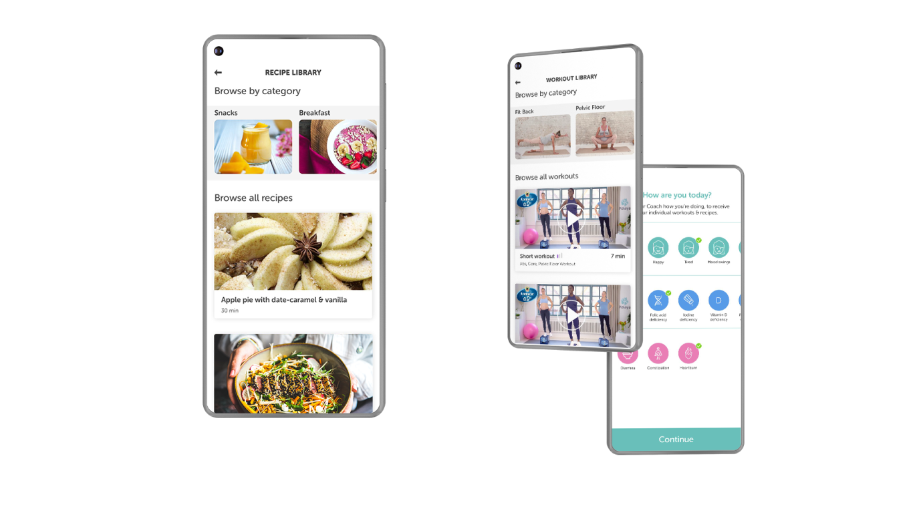

---
team_members:
  - agata
our_service:
  - mobile app development
layout: project
project_id: pregnancy-app
title: Pregnancy App
image: /images/pregnancy_app1.png
description: A healthcare mobile app that supports pregnant women at every stage
  of their pregnancy and birth experience providing them with exercises, recipes
  and tips.
hero_image: /images/case_study_app_pregnancyapp.png
Hero Image_alt: Pregnancy mobile app
social_media_previev: /images/pregnancyapp_fb_preview.png
social_media_previev_alt: Pregnancy App case study
bar_achievements:
  - number: "2"
    label: iOS and Android apps
  - number: "5"
    label: Key features
  - number: "9"
    label: month journey
tags:
  - mobile app
  - customized software
  - eHealth
title_team: team
title_case_study: case study
title_contact: Let's talk about your app
description_contact: Contact us and we'll get back to you in 48 hours!
order: 99
slug: pregnancy-app
show_team: false
show_case_study: false
show on homepage: false
published: true
language: en
---

## Main tech elements

* Apple and Android in app purchases
* Video content available to premium customers
* Deep integration with system calendar, reminders, push notifications
* In-depth user behaviour analytics
* A/B testing 

## Intro

The mobile app supports mothers-to-be by offering them ways to stay fit and eat healthy during their nine-month journey. The curated content is personalised based on the user interests. Each week brings a new set of exercises, recipes and tips.

## Process

The agency behind the pregnancy app had worked with Bright Inventions in the past on several products already. As before the client had conducted interviews with the potential users (mothers-to-be), analysed their needs and set up a rudimentary web-based proof of concept in order to verify their discoveries.

Once the need for the product was confirmed Bright Inventions got engaged. We kicked things off with a workshop in Berlin to understand the expectations and the required technical assets needed to be created. Luckily, two of the people engaged in the product from Bright Inventions side, were at the time fathers-to-be, closely supporting their partners and seeing the need for a product like that firsthand.

The development process was all about empathy. Building a product like this requires an immense amount of understanding of the user needs. No user interface element can be confusing, unclear or hard to use. An application for mothers-to-be needs to make things easy, obvious and fun. It also needs to build trust.

As Bright Inventions worked on the technical side of things (backend system, iOS and Android apps) the agency side handled the creation of the videos and recipes that were to be made available in the app for the paying customers.

A large part of the work was around building a solution that adapts the content to the users. By observing users' interactions with the provided recipes and workouts (i.e. what they marked as favourite, what they cooked, etc.) the system adjusts the material to personalise the experience.

Technical challenges lied primarily in ensuring the parity of features across platforms and deep integration with the system calendar. Events had to be automatically added to the calendar, synchronised across user devices and scheduled push notification had to be triggered at the appropriate times.

## Launch

The application was launched for iOS and Android at the same time to the positive reviews of the first users. With the help of the agency’s marketing team a solid user-base has been achieved in a relatively short amount of time.

The app has spun out as a separate company and started to build their own internal development team. Bright Inventions supported in all of those efforts, helping to pick the right engineers and with all of the knowledge transfer.
