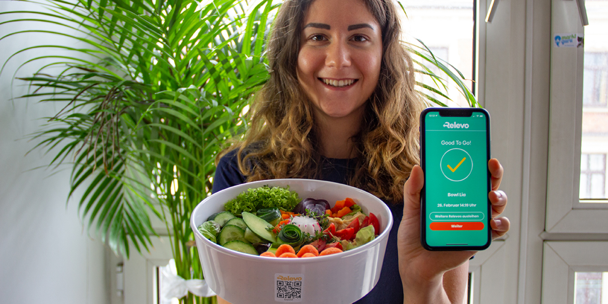
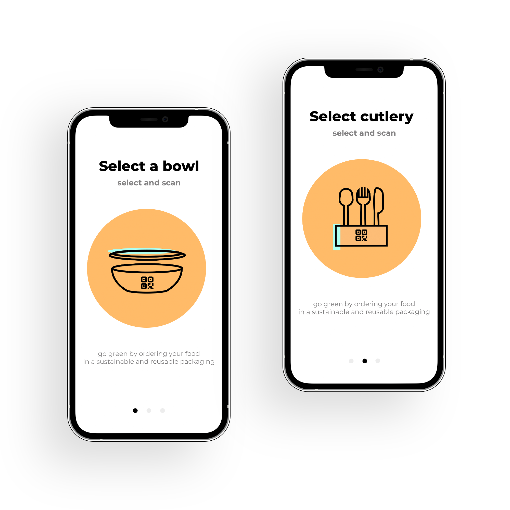
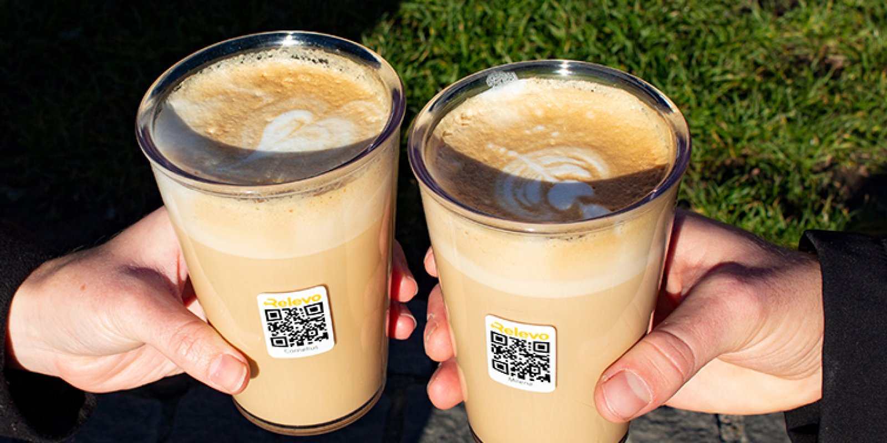
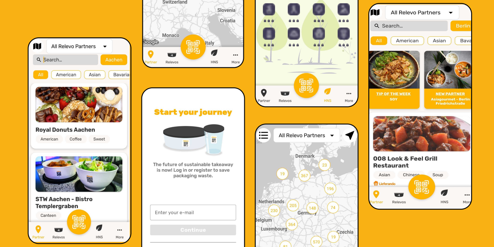

<TitleWithIcon sectionTitle="technologies" titleIcon="/images/skills.svg" titleIconAlt="bright" />

<Gallery images='[{"src":"/images/node.png","alt":"node"},{"src":"/images/nest.png","alt":"nest"},{"src":"/images/react.png","alt":"react"},{"src":"/images/MySQL.png","alt":"MySQL"},{"src":"/images/swift.png","alt":"swift"},{"src":"/images/kotlin.png","alt":"kotlin"},{"src":"/images/aws.png","alt":"aws"},{"src":"/images/ci_cd.png","alt":"ci_cd"}]' />

**technologies:** Node.js, NestJS, React, MySQL, SwiftUI, Kotlin, AWS

<TitleWithIcon sectionTitle="problem – the technology doesn&#39;t fully support Relevo’s mission" titleIcon="/images/icon_title_about.svg" titleIconAlt="problem" />

The year 2473 – by then, the plastic made today will probably have decomposed. Germany itself witnesses the consumption of approximately [3 million tons of plastic packaging yearly](https://www.statista.com/statistics/1265122/plastic-packaging-consumption-germany/). **Relevo, a Germany-based startup, introduced a pioneering solution: the provision of reusable containers for restaurants**, which could be borrowed by their customers free of charge. 

Relevo’s immense growth following the MVP launch was every startup founder's dream but it also presented some hurdles. As the app user base started to grow our client **needed an experienced tech partner to lead them through the further development providing a seamless Android and iOS mobile experience as well as transforming to new frameworks**.

The client sought a well-organized team ready to support them in scaling a best-in-class tableware reusable system that would be highly rated by the users. 

<AnchorLink href='#contactForm' text='let’s talk about your project'/>

<AppStore googleApp='https://play.google.com/store/apps/details?id=com.relevoapp' srcGoogle='/images/google_play.png' altGoogleImage='google play' appStore='https://apps.apple.com/us/app/relevo/id1501683637' srcAppStore='/images/app_store.png' altAppStoreImage='app store'/>

<TitleWithIcon sectionTitle="challenges: overcoming technical and cultural barriers " titleIcon="/images/gearwheel.svg" titleIconAlt="challenges" />

Lunch hours can be the nemesis of every food-related app. **Our primary challenge was to guarantee the stability of the system during peak hours**. By implementing a robust cloud infrastructure, we not only enhanced the application's reliability but also paved the way for other innovations.

Therefore our current emphasis is on the continuous development of a more mature product with a strong commitment to code quality. We have introduced a range of automated tests and are dedicated to further improving our quality assurance processes. **The challenge is to consistently deliver the most reliable and optimal solution that can be effectively extended to thousands of restaurants and an even larger user base**.

Another notable obstacle we confronted was a technical limitation – **many restaurants throughout Germany operate without reliable internet access. In response, we devised a solution by implementing an offline mode, transforming Relevo apps into [offline-first applications](https://brightinventions.pl/blog/offline-first-app-guide-for-startups-app-owners-case-studies/)**. This enhancement allows users to carry out essential actions within the app, such as borrowing food containers, even in offline conditions. Once their internet connection is restored, the app seamlessly synchronizes all data, ensuring a smooth and uninterrupted user experience.

The final hurdle is especially captivating because it leans toward cultural barriers rather than technical ones. **Users in Germany are cautious about downloading unfamiliar apps, so our team implemented App Clip and Instant App solutions to break this social barrier**. By implementing these technologies, we have streamlined the process of introducing new users to Relevo’s platform, instantly showcasing the app's key features on their screens without necessitating a full download. Over time, users opt to install the app as they recognize its value. Both App Clip and Instant App have evolved into significant channels for user acquisition.

<TitleWithIcon sectionTitle="solutions: a new approach to cloud &amp; web development" titleIcon="/images/two_flags.svg" titleIconAlt="solutions" />

At the heart of our work was a **massive tech revamp featuring Node.js, NestJS, and AWS** to supercharge performance, scalability, and efficiency. This allowed us to enhance the system on many levels. 

By leveraging the power of Node.js and NestJS, we aimed to create a robust and flexible backend architecture that could seamlessly support the application's evolving needs. Additionally, **the incorporation of AWS services offered us a reliable and scalable cloud infrastructure to host and manage applications and data**, further reinforcing our technical foundation.

In the front line, a **restaurant digital panel emerged with a management center for reusable tableware, orders, and tracking inventory** — everything in one sleek interface accessible to over **3,000 Relevo partners**.

Behind the scenes, we can’t forget about building the **admin panel for Relevos’ team to strengthen ties with their massive network of partners**. This invisible hand keeps the client's eco revolution thriving. It coordinates orders, troubleshoots, ensures smooth collaboration with every partner, and incorporates a robust analytics dashboard, providing valuable insights related to tableware borrowing. 

Finally, this green wave wouldn’t have taken place without **Android and iOS applications that enable over 200,000 Relevo users to borrow reusable tableware**. Users seamlessly scan QR codes on Relevo's packaging, enjoying their take-away food and drinks wherever they want.

<TitleWithIcon sectionTitle="result of the collaboration: transforming MVP into a fully mature solution that catalyzes the change " titleIcon="/images/icon_result_svg.svg" titleIconAlt="result of the collaboration: transforming MVP into a fully mature solution that catalyzes the change " />