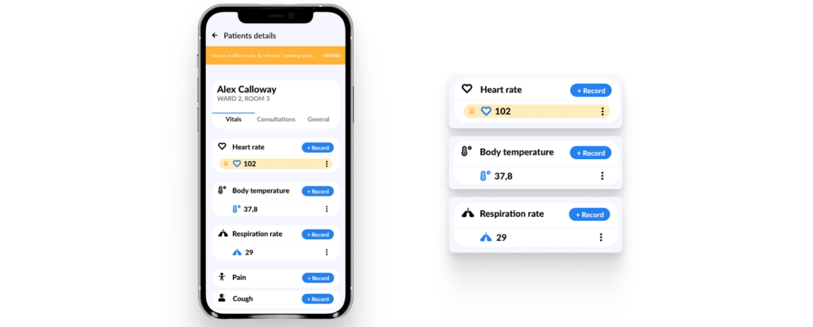
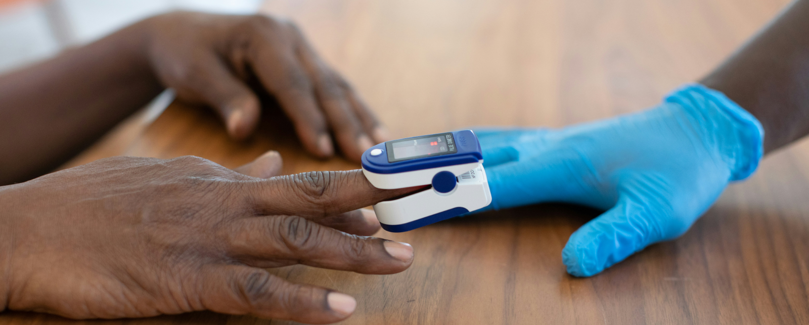
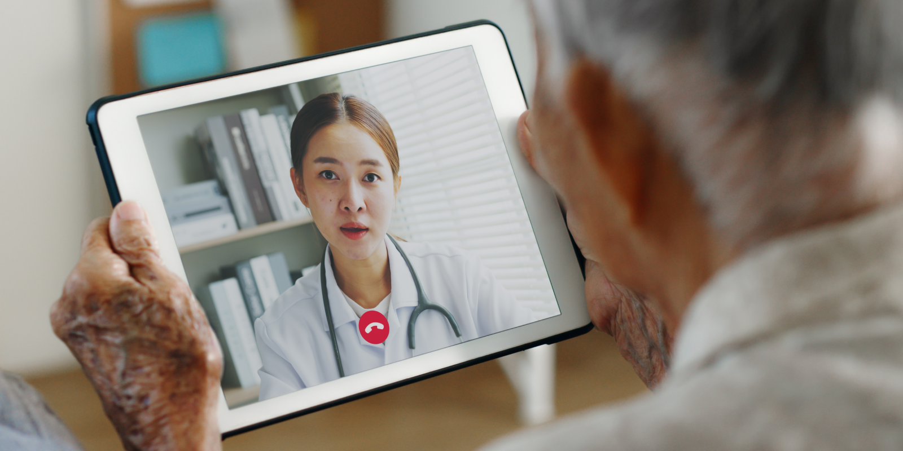

---
team_members:
  - kasia
  - krzysiek-s
  - piotr_r
  - michal
our_service:
  - mobile app development
  - product design
layout: project
project_id: Remote Patient Monitoring
title: Transforming Healthcare with NHS-Certified Bluetooth Devices
image: /images/case-study_cover_remote_monitoring.png
description: The future of healthcare lies in remote medical care. With the
  system we had the privilege to develop for Camascope, that future is already a
  reality. Physicians can remotely monitor patients' conditions, and if their
  vital signs become alarming, the algorithm will trigger an alert, recommending
  the initiation of emergency procedures.
hero_image: /images/ehealth_remote_case_study.png
Hero Image_alt: Transforming Healthcare with NHS-Certified Bluetooth Devices
social_media_previev: /images/fb_preview_patient_remote_control.png
social_media_previev_alt: Remote Patient Monitoring
bar_achievements:
  - number: 25k+
    label: Active users on Comascope systems
  - number: 1,000
    label: Health & Care Organisations
  - number: "3"
    label: Years of Collaboration
tags:
  - customized software
  - mobile app
  - eHealth
  - product design
title_team: the team behind the project
title_case_study: more success stories
title_contact: let's talk about your product
description_contact: Do you want to discuss your eHealth solution? Fill out the
  form below and we'll get back to you in 48 hours.
order: 4
slug: remote-patient-monitoring
show_team: true
show_case_study: true
show on homepage: false
published: true
language: en
---
<TitleWithIcon sectionTitle="key features built by Bright Inventions:" titleIcon="/images/icons_features_svg.svg" titleIconAlt="features" />

* Connecting Bluetooth healthcare devices into one system.
* Monitoring patient's vital signs.
* Offline mode enables the measurement of a patient’s vitals without an internet connection.
* Analyzing patient's condition with a customized algorithm.
* Sharing patient’s results with a physician.
* Triggering an alarm if the patient’s medical condition reaches a life-threatening state.
* Video consultations.

<TitleWithIcon sectionTitle="stack" titleIcon="/images/skills.svg" titleIconAlt="bright" />

<Gallery images='[{"src":"/images/android_stack_logo.svg","alt":"Android"},{"src":"/images/kotlin_new_stack_logo.svg","alt":"Kotlin"},{"src":"/images/bluetooth_stack_logo.svg","alt":"Bluetooth"},{"src":"/images/adobexdstack_logo.svg","alt":"AdobeXD"}]' />

**Android development:** Dagger, Kotlin Coroutines, Jetpack Libraries

**Product design**: Adobe XD

<TitleWithIcon sectionTitle="addressing staff shortages and rising health challenges" titleIcon="/images/icon_title_about.svg" titleIconAlt="addressing staff shortages & rising health challenge" />

Healthcare systems worldwide face unprecedented challenges, highlighted by the strains of the COVID-19 pandemic. Notably, the United Kingdom has grappled with staffing shortages, with [NHS workforce data](https://lordslibrary.parliament.uk/staff-shortages-in-the-nhs-and-social-care-sectors/#heading-1) revealing an increase in overall and nursing vacancies despite a slight increase in medical positions.

In parallel, a surge in patients grappling with chronic illnesses and mental health concerns poses a pressing concern. The WHO reports that depression affects [264 million people globally,](https://www.who.int/news-room/fact-sheets/detail/mental-disorders) while [6 out of 10 U.S. adults suffer from chronic conditions](https://www.cdc.gov/chronicdisease/about/index.htm). Conventional healthcare services struggle to meet this growing demand, emphasizing the pivotal role of digitalization in offering effective solutions.

<TitleWithIcon sectionTitle="empowering healthcare transformation: RPM and telemedicine" titleIcon="/images/icon_title_goal.svg" titleIconAlt="empowering healthcare transformation: RPM and telemedicine" />

**[Camascope](https://www.camascope.com/), formerly known as VCare, is a pioneering British health tech company** that has fully embraced the potential of **Remote Patient Monitoring (RPM) and telemedicine**. **Their collaboration with Bright Inventions has already yielded a robust Medicine Administration Record (eMAR) system**, available on both Android and iOS platforms. This eMAR system effectively connects pharmacies with care homes, facilitating the secure, efficient, and compliant distribution of medication.

**Camascope has set us a new challenge: the development of a pilot RPM system for the Android platform**. This groundbreaking system allows for the remote monitoring of patients' vital signs, enabling physicians to oversee their patients' health remotely. This innovation not only revolutionizes post-discharge care, allowing patients to leave the hospital earlier while still receiving continuous medical attention but also optimizes daily care in numerous care homes throughout the United Kingdom.

**The RPM system is centered around an Android application, complemented by a couple of Bluetooth health-monitoring devices expertly integrated by the Bright Inventions team**. These devices empower medical professionals to efficiently manage more patients without the need for individual, time-consuming examinations. They continuously monitor patients' conditions, with the application seamlessly handling data analysis. In the end, the physician can initiate treatment based on the insights provided by the algorithm that drives this healthcare application.

<AnchorLink href='#contactForm' text='let’s talk about your project'/>

<TitleWithIcon sectionTitle="the challenge of integrating Bluetooth devices into a system" titleIcon="/images/two_flags.svg" titleIconAlt="the challenge" />

Our team faced the formidable challenge of integrating various devices with distinct Software Development Kits (SDKs) into a cohesive system. With our Android team's expertise, we successfully harmonized these disparate SDKs into a unified system. Additionally, the team developed an algorithm capable of swiftly detecting whether a patient's vital signs indicate an immediate need for assistance. The data is transmitted to the doctor, and an alert is generated, suggesting that the patient considers calling an ambulance.

*It is not a real implemented design. It is a mockup example created for the purpose of a case study.*

### The examples of devices incorporated into the system

* **Pulse oximeter**: a device that monitors the oxygen saturation of the patient’s blood.
* **Bluetooth Thermometer**: a thermometer that also sends data to the app.
* **Sphygmomanometer**: a blood pressure monitor.
* **Spirometer**: a device that measures the volume of air inhaled and exhaled by a human’s lungs.
* **Stethoscope**: known as the primary doctor’s tool, can now be used remotely by other caregivers at care homes and nursing homes.
* **Wearable continuous monitoring devices**: a device worn for example on a patient’s arm that monitors the vital signs in real-time, 24 hours a day.

<TitleWithIcon sectionTitle="revolutionizing healthcare access with video consultations" titleIcon="/images/icon_title_products.svg" titleIconAlt="revolutionizing healthcare access with video consultations" />

We have answered the call from Camascope, providing a seamless video consultation feature within their Android app. Patients have a scheduled consultation in the app; all they need to do is join the meeting, enabling the camera and microphone. 

Telemedicine saves patients' and doctors' time, allowing physicians to monitor more patients at the same time. Telemedicine opened a new, safer way to consult a doctor, especially during a pandemic, so we are extremely proud that we got a chance to implement that feature for our client.

<TitleWithIcon sectionTitle="supporting the client in setting ISO healthcare standards" titleIcon="/images/three_flags.svg" titleIconAlt="supporting the client in setting ISO healthcare standards" />

Camascope has become an official NHS supplier, and they are also an ISO 27001 accredited company. Bright Inventions, as a company developing systems for healthcare clients, was required to follow a variety of security protocols. 

Being a company strongly focused on security, we adhere to necessary restrictions, such as obtaining an information security policy updated every 6 months. We have security-related job responsibilities and accountabilities. We conduct regular inventories of important information assets, and employees who need to be granted access are first screened regarding their legal status according to Polish and EU standards.

<TitleWithIcon sectionTitle="the outcome of Camascope and Bright Inventions collaboration" titleIcon="/images/icon_result_svg.svg" titleIconAlt="the outcome of Camascope and Bright Inventions collaboration" />

After **successfully launching the pilot solution** based on an Android application, the positive feedback from the end users encouraged the client to continue developing the solution. **We provided ongoing support during the critical months post-launch**, delivering new features and handling maintenance. 

Comascope products are used by over 1,000 health & care organization customers with over 25,000 active patients on the system. We are proud to have been a part of this significant advancement in health technology and are confident that **this product will positively impact the lives of hundreds of thousands of people**.