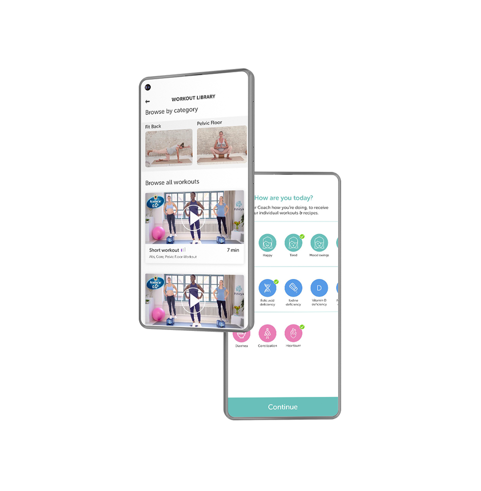
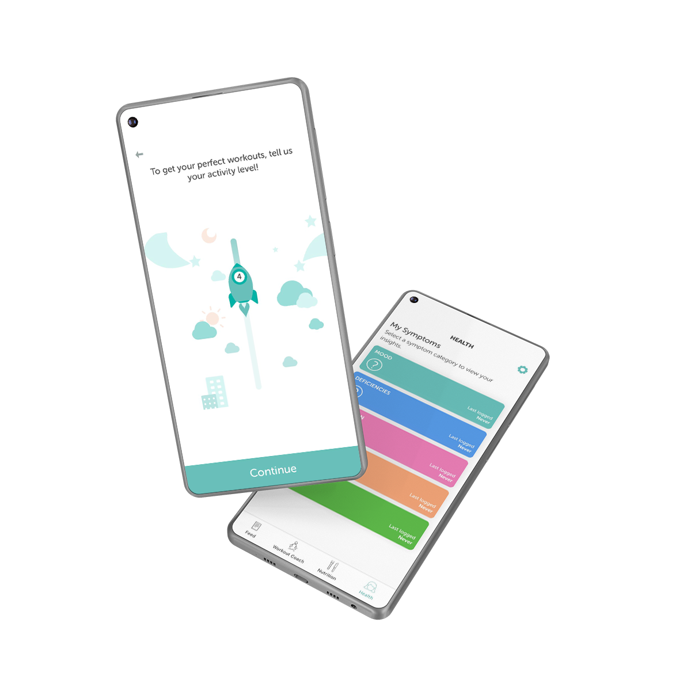

---
team_members:
  - michal
our_service:
  - MVP-Entwicklung Agentur
layout: project
project_id: Pregnancy App German
title: App fur Schwangere Frauen
image: /images/pregnancy_app1.png
description: Eine mobile App für das Gesundheitswesen, die schwangere Frauen in
  jeder Phase ihrer Schwangerschaft und Geburt unterstützt und ihnen Übungen,
  Rezepte und Tipps zur Verfügung stellt.
hero_image: /images/case_study_app_pregnancyapp.png
Hero Image_alt: Schwangerschafts-App
social_media_previev: /images/fb_preview_case_study_pregnancy_app_de.png
social_media_previev_alt: Schwangerschafts-App
bar_achievements:
  - number: "2"
    label: iOS und Android apps
  - label: Haupteigenschaften
    number: "5"
  - number: "9"
    label: monatige Reise
tags:
  - mobile app
  - customized software
  - eHealth
title_team: team
title_case_study: weitere von uns entwickelte Anwendungen
title_contact: kontaktieren Sie uns
description_contact: Erzählen Sie uns mehr über Ihr Projekt oder Ihre Idee für
  eine App. Füllen Sie das Formular aus.
order: 99
slug: schwangerschafts-app
show_team: false
show_case_study: true
show on homepage: false
published: false
language: de
---

## Wichtigste technische Elemente

* Apple- und Android-In-App-Käufe
* Videoinhalte für Premium-Kunden verfügbar
* Tiefe Integration mit Systemkalender, Erinnerungen, Push-Benachrichtigungen
* Detaillierte Analysen des Benutzerverhaltens
* A/B-Tests

## Einleitung

Die mobile App unterstützt werdende Mütter, indem sie ihnen Möglichkeiten bietet, während ihrer neunmonatigen Reise fit zu bleiben und sich gesund zu ernähren. Die kuratierten Inhalte werden basierend auf den Nutzerinteressen personalisiert. Jede Woche bringt eine neue Reihe von Übungen, Rezepten und Tipps.

## Verfahren

Die Agentur hinter der Schwangerschafts-App hatte in der Vergangenheit bereits bei mehreren Produkten mit Bright Inventions zusammengearbeitet. Wie zuvor hatte der Kunde Interviews mit den potenziellen Benutzern (werdenden Müttern) geführt, ihre Bedürfnisse analysiert und einen rudimentären webbasierten Proof of Concept eingerichtet, um ihre Entdeckungen zu verifizieren

Sobald der Bedarf für das Produkt bestätigt war, engagierte sich Bright Inventions. Wir begannen mit einem Workshop in Berlin, um die Erwartungen und die erforderlichen technischen Ressourcen zu verstehen, die geschaffen werden mussten. Glücklicherweise waren zwei Personen, die von Bright Inventions an dem Produkt beteiligt waren, zu dieser Zeit werdende Väter, die ihre Partner intensiv unterstützt haben und die Notwendigkeit eines solchen Produkts gesehen haben.

Der Entwicklungsprozess war geprägt von Empathie. Der Aufbau eines solchen Produkts erfordert ein immenses Verständnis der Benutzeranforderungen. Kein Element der Benutzeroberfläche darf verwirrend, unklar oder schwer zu bedienen sein. Eine Anwendung für werdende Mütter muss die Dinge einfach, offensichtlich und unterhaltsam machen. Es muss auch Vertrauen aufbauen.

Da Bright Inventions auf der technischen Seite (Backend-System, iOS- und Android-Apps) arbeitete, hat die Agenturseite die Erstellung der Videos und Rezepte übernommen, die in der App für die zahlenden Kunden verfügbar gemacht werden sollten.

Ein großer Teil der Arbeit bestand darin, eine Lösung zu bauen, die die Inhalte an die Benutzer anpasst. Durch die Beobachtung der Interaktionen der Benutzer mit den bereitgestellten Rezepten und Workouts (d. h. was sie als Favoriten markiert haben, was sie gekocht haben usw.) passt das System das Material an, um das Erlebnis zu personalisieren.

Technische Herausforderungen bestanden in erster Linie darin, die Parität der Funktionen auf allen Plattformen und die tiefe Integration mit dem Systemkalender sicherzustellen. Ereignisse mussten automatisch zum Kalender hinzugefügt, auf allen Benutzergeräten synchronisiert und geplante Push-Benachrichtigungen zu den entsprechenden Zeiten ausgelöst werden.

## Start

Die Anwendung wurde aufgrund der positiven Bewertungen der ersten Benutzer gleichzeitig für iOS und Android gestartet. Mit Hilfe des Marketingteams der Agentur wurde in relativ kurzer Zeit eine solide Nutzerbasis erreicht.

Die App hat sich als separates Unternehmen ausgegliedert und mit dem Aufbau eines eigenen internen Entwicklungsteams begonnen. Bright Inventions hat all diese Bemühungen unterstützt, half bei der Auswahl der richtigen Ingenieure und beim gesamten Wissenstransfer.
