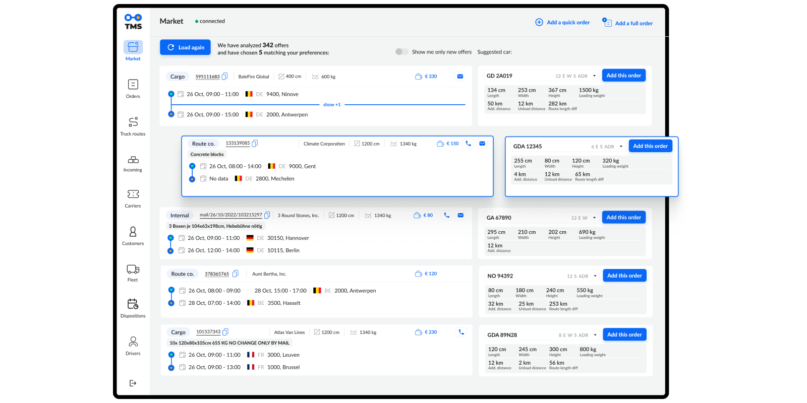
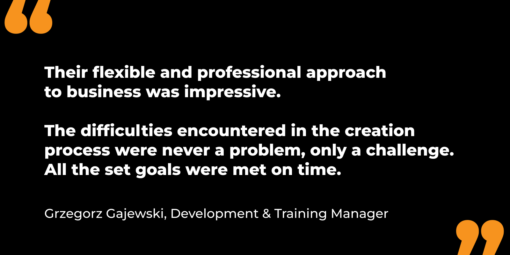
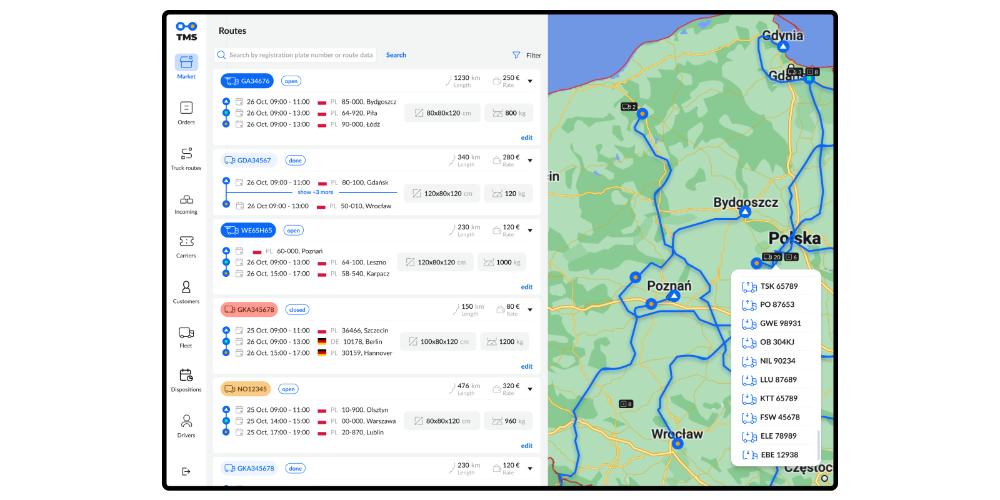
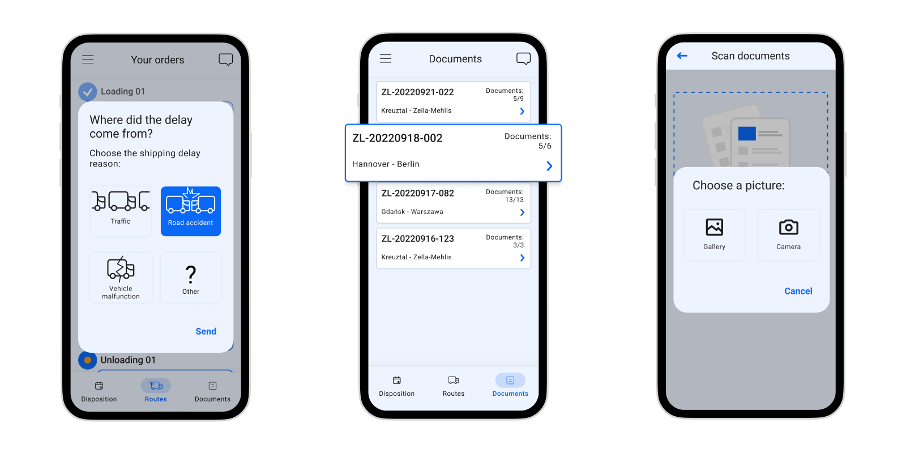
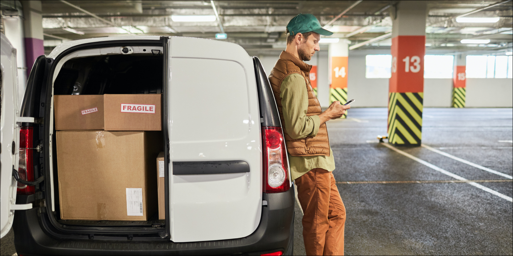

---
team_members:
  - agnieszka
  - kasia
  - joanna-c
  - radek
  - wojciech
  - maciej-s
  - katarzyna-b
  - wojciech-k
our_service:
  - MVP development
  - product design
  - web development
layout: project
project_id: tms
title: "Revolutionizing Logistics: How We Transformed a Transport Management System"
image: /images/tms_cover_2x.png
description: The Transport Management System analyses routes, cutting the time
  from 10-30 seconds to just 3-5 seconds per order, providing unparalleled speed
  and efficiency in the logistics sector. With the ever-increasing demands of
  the logistics industry, having the right tools in place is essential for
  smooth operations. Our client's system is tailored to address their needs,
  ensuring optimal performance and customer satisfaction.
hero_image: /images/case_study_road_transportation.png
Hero Image_alt: Transportation Management System
social_media_previev: /images/tms_social_preview.png
social_media_previev_alt: Transportation Management System case study
bar_achievements:
  - number: "42"
    label: countries
  - number: 300 h
    label: saved per employee a year
  - number: 3-5 sec
    label: to analyze routes per order
tags:
  - web app
  - mobile app
  - customized software
  - MVP
  - product design
title_team: meet the team behind the solution
title_case_study: more success stories
title_contact: let's talk about your solution
description_contact: Book a free consultation in 48 hours.
order: 2
slug: transportation-management-system
show_team: true
show_case_study: true
show on homepage: false
published: true
language: en
---
<TitleWithIcon sectionTitle="main features developed by Bright Inventions" titleIcon="/images/icons_features_svg.svg" titleIconAlt="main features developed by Bright Inventions" />

* **Importing freight listings** from popular transport marketplaces.
* **Filtering out listings** that don’t match the basic criteria (weight and size of the load, route details, etc.).
* **Preliminary matching** of the listings with the right vehicle and driver. Then it can be verified by the forwarder.
* **Managing the route** from arrival to the destination point. Adding extra points on the carriers’ map.
* Receiving **notifications from the drivers** about delays or other disturbances on the road.

<TitleWithIcon sectionTitle="stack" titleIcon="/images/skills.svg" titleIconAlt="bright" />

<Gallery images='[{"src":"/images/new_typescript_logo_stack.png","alt":"TypeScript"},{"src":"/images/react.png","alt":"React"},{"src":"/images/nest.png","alt":"Nest"},{"src":"/images/aws.png","alt":"AWS"},{"src":"/images/kotlin_new_stack_logo.svg","alt":"Kotlin"},{"src":"/images/new_logo_figma_stack.png","alt":"Figma"}]' />

**Frontend**: TypeScript, React, Redux, React Query

**Backend**: Nest.js, TypeScript, AWS, PostgreSQL, Prisma

**Android development**: Kotlin, Coroutines, Flows, ViewModel, Firebase, Hilt, and other Google APIs

**Product design**: Figma, Adobe Illustrator

<TitleWithIcon sectionTitle="about TMS project" titleIcon="/images/three_flags.svg" titleIconAlt="bright" />

The client started a collaboration with Bright Inventions to **build a customized tool for their internal transport management department**. It offers one of the fastest and safest forwarding and transport services to companies all over Europe. In 2022 they executed over 180,000 shipping orders.

Like many logistics companies our client struggled with endless paperwork, and tons of Excel sheets, which defined the inefficient core of their transport management system. They aimed for a change, hoping for a successful digitalization of their daily work. But, **finding an off-the-shelf solution that truly fit their unique needs was a challenge**. **That's when they partnered with Bright Inventions to craft a tailor-made Transport Management System.** 

<AnchorLink href='#contactForm' text='let’s talk about your project'/>

<TitleWithIcon sectionTitle="first things first – time to validate the idea with MVP " titleIcon="/images/goal_title_section.png" titleIconAlt="goal" />

Our client's main goal? To **see if their software management system idea could handle their daily operations and potentially grow into something bigger**. Our solution? **Start small and smart with an MVP** (Minimum Viable Product) – the quickest path to validating your game-changing ideas.

The solution was supposed to **transform forwarders’ work into a less repetitive, faster, and more automatic job**. The aim was to limit both: the time between finding and matching load with the right transport provider and the number of kilometers done by empty vehicles. Fast and effective utilization of vehicles' spare capacity is essential for the industry. 

Also, another long-term goal is to **support daily communication with road hauliers with a customized Android application** dedicated to drivers.

<AnchorLink href='#contactForm' text='let’s talk about your project'/>

<TitleWithIcon sectionTitle="the challenge of building a transport management system" titleIcon="/images/two_flags.svg" titleIconAlt="bright" />

The main challenge was to **build a fast solution**. Time is the key to the shipping industry. The app has to aggregate the listings quickly and assign them to the right carriers. Every millisecond counts.

Our team designed an **algorithm that would automatically filter out transport listings to display only the ones that match the client's expectations**.

In terms of product design, the right **architectural information** is the key. **Forwarders work at a high pace and they expect any work tool to make their job even faster**. The client required us to include as much information as possible on one screen, so they could scan all the information fast.

<TitleWithIcon sectionTitle="TMS development process" titleIcon="/images/gearwheel.svg" titleIconAlt="bright" />

**At Bright Inventions, we took charge of every stage in creating the MVP** – from defining requirements and product design, through web development, rigorous quality testing, and efficient cloud management, to a successful launch. Naturally, our work didn't stop there. We are here for ongoing maintenance, too. The MVP took off in October 2022, and the client's team loved what they saw.

### Web development based on the latest technologies

From the beginning, **we were entrusted to choose the right stack** and had the pleasure of implementing the top tools available at the moment.

While we were venturing into the realm of MVP implementation, our commitment to forward-thinking was unwavering. **The technical stack we selected had to be future-proof, and capable of facilitating seamless long-term system integration**. This choice prioritized rapid implementation, uninterrupted performance, and the agility to effortlessly incorporate new features.

Our objective extended beyond ensuring a frictionless user experience. We also aimed to streamline the software development process, optimizing time and effort allocation for our team in the foreseeable future. To make it possible **we implemented the best solutions JavaScript and AWS have to offer with Lambda and SNS on top of them**.

### Product design: the key success factor to a smooth digital transformation

Before our team presented the MVP mockups we took the necessary steps that helped us design the product. Our process commenced with comprehensive **desk research**, seamlessly transitioning into rigorous **benchmarking**. Furthermore, we leveraged the valuable opportunity to engage in **field studies** and **user shadowing**, complemented by adaptive interviews.

The challenge confronting the product design team was the **development of a user-friendly, yet data-intensive system. Our primary objective was to ensure a seamless transition for users who have long relied on existing tools**. Users had to swiftly recognize the advantages offered by the new solution. 

We addressed this challenge by implementing best UX practices such as: **representing a mental model** of end users, designing a **navigation flow based on familiar user patterns**, and incorporating an **information hierarchy** to include as much data as possible on a screen without overwhelming users.

Read our blog post to find more recommendations for [UX design for the transport management software](/blog/ux-design-transport-management-software-case-study/).

### Mobile development for effective communication between freight forwarders and drivers

**Following the triumphant MVP launch of a web application, our client chose to partner with us for mobile app development**. We have been hard at work crafting a **native Android mobile app**, and the MVP has just hit the market. Exciting times ahead!

**The mobile app supports communication between forwarders and drivers**. For example, it allows sharing of carriers' localization with the forwarders and sending scans of documents. After the MVP launch, the app is now being tested by the first users.

It is essential to highlight the significance of product design in the context of a mobile application. **The mobile application is specifically designed for haulers, where the display of only essential information, such as loading specifics and route details, is paramount**. Distractions with extraneous information are minimized. The user interface prioritizes simplicity, enabling couriers to promptly update loading statuses, such as “delivered” or “delayed”. 

**The app makes it a breeze to upload transport order documents**. Our design is all about being clear and user-friendly, with big, eye-catching buttons that set it apart from the ordinary business apps you come across every day.

<TitleWithIcon sectionTitle="the outcome of collaboration" titleIcon="/images/icon_result_svg.svg" titleIconAlt="client’s perspective" />

MVP launch ensured the client that the system has the potential to change the daily work on their team. **The company is on the verge of a complete digital transformation**. At this moment **90% of daily transport management operations are done with the new system**.

**Our team managed to meet the crucial client’s requirement** – delivering a fast transport listings filtering system. As a result, **the system analyses routes for forwarders in up to 5 seconds per order, saving a total of 300 h per employee a year**. Before that, the filtering process had to be done manually.

<TitleWithIcon sectionTitle="client’s perspective" titleIcon="/images/clients_perspective_icon.svg" titleIconAlt="client’s perspective" />

*Their flexible and professional approach to business was impressive. The difficulties encountered in the creation process were never a problem, only a challenge. All the set goals were met on time.*

**Grzegorz Gajewski, Development & Training Manager**

<TitleWithIcon sectionTitle="what lies ahead for our collaboration with a leading logistics company?" titleIcon="/images/icon_title_products.svg" titleIconAlt="result" />

We’re delighted that **the client decided to continue our cooperation after a successful MVP launch – both web and mobile versions**. Now we focus on scaling the product in the post-MVP phase. Our team implements new features such as the electronic circulation of documents.

We still work closely with end users, quickly responding to their feedback. Open communications, flexibility, and adaptability are the key factors of this successful digitalization.