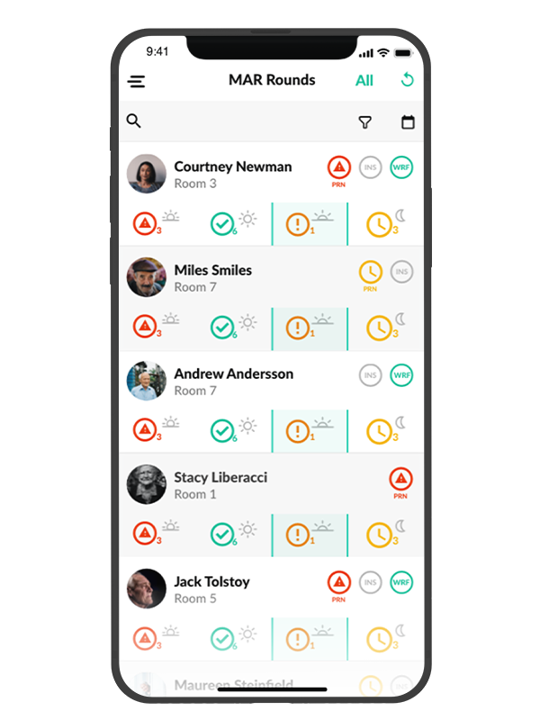
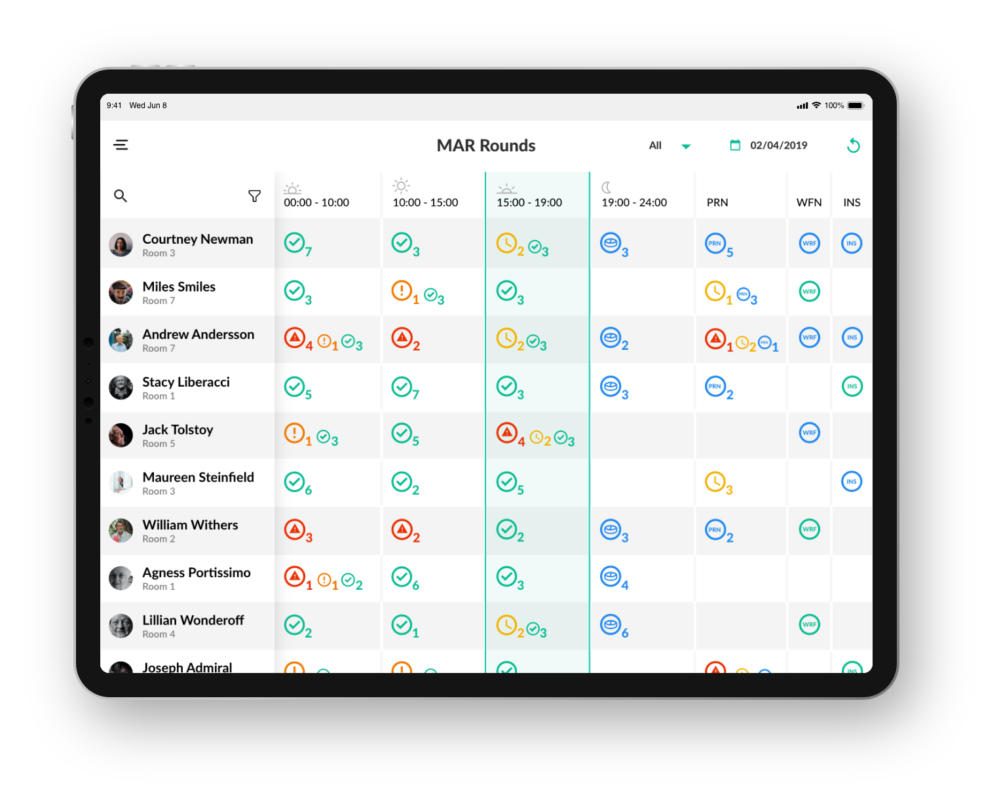

---
team_members:
  - kasia
  - piotr_r
  - krzysiek-s
  - michal
our_service:
  - mobile app development
  - web development
  - product design
layout: project
project_id: vcare
title: "Digitally Connecting the UK Care Homes with Camascope: Trusted by 1000+
  Health Organizations"
image: /images/case-study_cover_emar.png
description: Behind the story of Camascope, there is a pharmacist who
  experienced firsthand the challenges care home professionals faced in
  medication distribution. This pharmacist was Saurabh Shah, the founder of
  Camascope (prev. vCare). With our help, Camascope now digitally streamlines
  daily medication routines for 25,000+ patients across the UK.
hero_image: /images/case_study_emar_healthtech.png
Hero Image_alt: A healthcare software solution
social_media_previev: /images/fb_preview_case_study_emar.png
social_media_previev_alt: vCare case study
bar_achievements:
  - number: 25k+
    label: Active users on Comascope systems
  - number: 1000+
    label: Health & Care Organisations
  - number: 69M+
    label: Medicines administered using Camascope
tags:
  - mobile app
  - web app
  - product design
  - IoT
  - customized software
  - eHealth
  - bluetooth
title_team: team behind the project
title_case_study: more success stories
title_contact: let's talk about your product
description_contact: Tell us more about your mobile project or idea for an app.
  Fill out the form below and we'll get back to you in 48 hours.
order: 99
slug: vCare
show_team: true
show_case_study: true
show on homepage: false
published: true
language: en
---
<TitleWithIcon sectionTitle="main features developed by Bright Inventions" titleIcon="/images/main_features_icon.png" titleIconAlt="features" />

* Managing list of care home patients 
* Registering medicine administration
* Overview of medicine schedule for patients
* Marking missed or skipped medicine administrations
* Adding notes on patients’ state while administering medication
* Requiring the supervisor’s approval for actions that might put the patient at risk
* Setting reminders for subsequent medication administration

<TitleWithIcon sectionTitle="technologies" titleIcon="/images/skills.svg" titleIconAlt="stack" />

<Gallery images='[{"src":"/images/kotlin.png","alt":"Kotlin"},{"src":"/images/swift.png","alt":"Swift"},{"src":"/images/adobexdstack_logo.png","alt":"Adobe XD"},{"src":"/images/bluetooth_stack_logo.svg","alt":"Bluetooth"}]' />

**technologies:** Kotlin, Swift, Bluetooth, Adobe XD

<TitleWithIcon sectionTitle="about Comascope (prev. VCare)" titleIcon="/images/three_flags.svg" titleIconAlt="about" />

When we entrust our loved ones to a care home or assisted living facility, we want to be absolutely sure that their health and safety are a top priority. VCare is a software that helps care homes offer the highest level of care by making it easy to administer the right medication and dosage to residents, at the exact right time of day.

<TitleWithIcon sectionTitle="goal" titleIcon="/images/goal_title_section.png" titleIconAlt="goal" />

When we first spoke to the [VCare](https://www.vcaresystems.co.uk) team, there was already a working Android app present on the market. However, the Founders were looking to take the software to a new level by improving the design and code, and by exponentially growing the app’s reach to new target groups.

Firstly, VCare wanted to make their healthcare solution available to facilities using iOS-based devices. This meant that an iOS app that would work on both mobile and tablet devices needed to be developed from scratch.

Secondly, the VCare team was looking for major design and code refinements for the existing Android app and software. They have also decided to develop several new features to further ensure patients’ security and facilitate caregivers’ daily work.

<TitleWithIcon sectionTitle="process of developing vCare application" titleIcon="/images/gearwheel.svg" titleIconAlt="bright" />

Our design team’s goal was to create intuitive, reliable mobile apps that would make it easy to register medicine administration and view historical records for each patient. It was absolutely crucial that anyone using the app knew whether a given resident had already taken his/her medication, and had the option to add a note on the patient’s profile.

To further increase the security of home care residents, the software also needed to include a supervisor approval feature for any significant change in treatment applied by a member of staff.

Our designers worked on the redesign and incorporation of these and several other new features to the Android app, and designed the entire experience for iOS.

For updating the Android app, our developers worked in Kotlin, and applied Room library for the database, Dagger for dependency injection, and Coroutines for asynchronous programming.

For iOS, we chose to work in Swift, and – among others – applied Cocoa Pods for dependency injection, Nimble and Quick for running tests, and Teamcity and Fastlane for deployment.

<TitleWithIcon sectionTitle="result" titleIcon="/images/results_icon_title_small.png" titleIconAlt="result" />

The iOS and updated Android apps were released in 2019. For three years after the launch, we actively supported the client in maintenance and delivered new features. We are happy to see how the product is growing. We are also grateful for the opportunity to support the client during the crucial period after the launch.