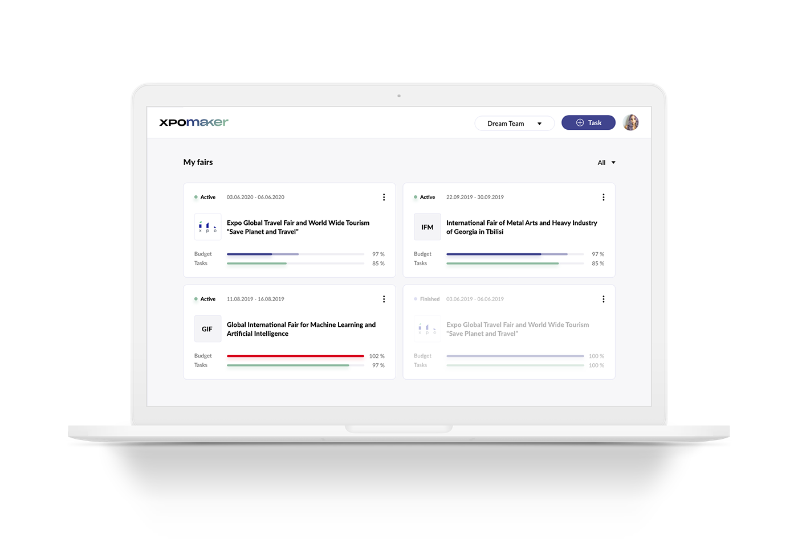
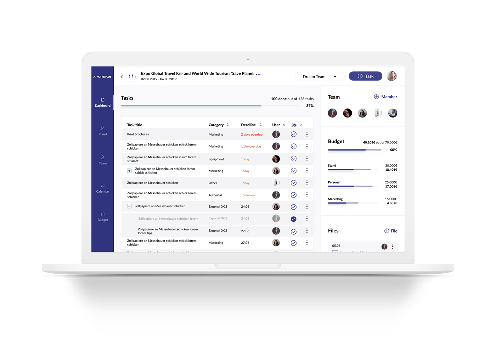

---
team_members:
  - michal
  - kasia
our_service:
  - MVP development
  - web development
  - product design
layout: project
project_id: xpomaker
title: xpomaker
image: /images/xpomaker_dashboard.png
description: >
  A trade fair planning software that revolutionizes the way companies prepare
  and organize all assets needed for industry events.
hero_image: /images/case_study_event_management_fair_app.png
Hero Image_alt: event manegement app
social_media_previev: /images/xpomaker_fb_preview.png
social_media_previev_alt: xpomaker case study
bar_achievements:
  - number: "1"
    label: MVP
  - number: "7"
    label: Key features
  - number: "7"
    label: People on team
tags:
  - web app
  - product design
  - MVP
  - customized software
  - startup
title_team: team
title_case_study: more success stories
title_contact: Let's talk about your app
description_contact: Contact us to discuss your product. Book a free consultation in 48 hours!
slug: xpomaker
show_team: false
show_case_study: true
show on homepage: false
published: true
language: en
---

<TitleWithIcon sectionTitle='main features developed by Bright Inventions' titleIcon='/images/main_features_icon.png' titleIconAlt='features' />

* Creation of new fair projects
* Inviting users to projects as team members
* Task management panel
* Adding and managing list of items needed for fair stands
* Managing fair staff accomodation and timetables
* Calendar view of tasks and events planned for the fair
* Budget and expense management planner

<TitleWithIcon sectionTitle='skills' titleIcon='/images/skills.svg' titleIconAlt='skills' />

<Gallery images='[{"src":"/images/react.png","alt":"React"},{"src":"/images/new_typescript_logo_stack.png","alt":"TypeScript"},{"src":"/images/nest.png","alt":"NestJS"},{"src":"/images/postgresql_logo_stack.png","alt":"PostgreSQL"},{"src":"/images/docker_stack_logo.png","alt":"Docker"},{"src":"/images/teamcity_stack_logo.png","alt":"Teamcity"},{"src":"/images/aws.png","alt":"AWS"}]' />

* Frontend: ReactJS + TypeScript, Redux, Sass
* Backend: NestJS, TypeORM, PostgreSQL, Swagger, Stripe
* Deployment: Docker + Docker-Compose, AWS - CloudFormation, ECS, EC2, S3, LoadBalancer, RDS, TeamCity

<TitleWithIcon sectionTitle='about' titleIcon='/images/three_flags.svg' titleIconAlt='bright' />

For many industries, participating in fairs lies at the heart of business, and is a key element of sales, lead generation, and building B2B partnerships. However, being responsible for exhibiting at industry events can feel overwhelming given the number of tasks involved. In most cases, your fair presence must be carefully planned months in advance, and requires you to simultaneously coordinate multiple processes. A single delay from a contractor or a minor omission on your side, and – like a game of dominoes – the whole plan can collapse.

So, how do you stay on top of all this without worrying about organizational chaos and deadlines? Here’s where xpomaker comes into play.

<TitleWithIcon sectionTitle='goal' titleIcon='/images/goal_title_section.png' titleIconAlt='goal' />

The Founders of xpomaker were looking for an experienced product design team who would translate the general vision for the software into a user-friendly, visually-appealing product. When our paths first crossed, they had already been cooperating with a consulting company that helped determine the necessary UX features and user expectations. While our cooperation initially started off with an interface design project, we were quickly asked to rebrand and redesign the entire app – including taking care of frontend and backend adjustments.

<TitleWithIcon sectionTitle='development process' titleIcon='/images/gearwheel.svg' titleIconAlt='bright' />

We first worked on delivering high-fidelity wireframes of the proposed user interface. To make sure that the designs incorporated all necessary features, our team cooperated with the consulting company’s product owner.

For xpomaker, it was crucial that the app architecture and design felt familiar to users. This meant that we were to design an interface that would resemble the experience of using spreadsheets for tracking fair preparation progress. Hence, we knew that a table format, as well as .xls file import/export were two features that needed to be taken into account and reflected in the design.

Secondly, the app needed to incorporate a payment process that would allow users to manage revenue and wire funds. Having analyzed multiple payment solutions on the market, we have decided on Stripe, which featured subscription payments and invoice handling – both essential to the client.

All of these steps allowed us to deliver a solution that is both functional and intuitive to its users.

After our work on the interface design had finished, xpomaker engaged us in a rebranding project they had been working on. The scope of our work included applying all necessary software development adjustments on the frontend and backend of the app.

After the rebranding phase of our cooperation when the name and the visual identity of the company had changed, our team redesigned the entire app and refine the software accordingly.

<TitleWithIcon sectionTitle='result' titleIcon='/images/results_icon_title_small.png' titleIconAlt='result' />

xpomaker is now present on the German market and offers three subscription plans. The software lets users coordinate as many exhibition projects as needed.

Our team is currently responsible for the app maintenance. However, the app founders are now collecting user feedback in preparation for another round of user-inspired design and software work.
