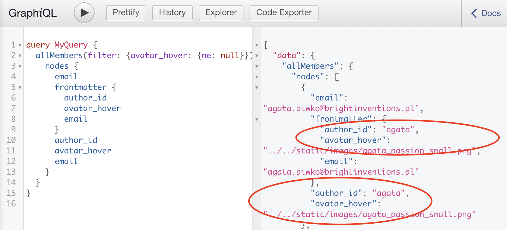

## Content collections

This plugin will use [config.yml](../../static/admin/config.yml)
to transform nodes created by `gatsby-plugin-mdx` into dedicated collection nodes.

This way in GraphQL you can query them directly via `allBlog`, `allMembers` etc.

The plugin will also build relations between nodes as defined via `relation` widget
in [config.yml](../../static/admin/config.yml).

## `frontmatter` flattening

The plugin will flatten all fields that appear in `frontmatter` to top level e.g.:

The original `frontmatter` is preserved in case there are conflicting fields (e.g. `id`)
